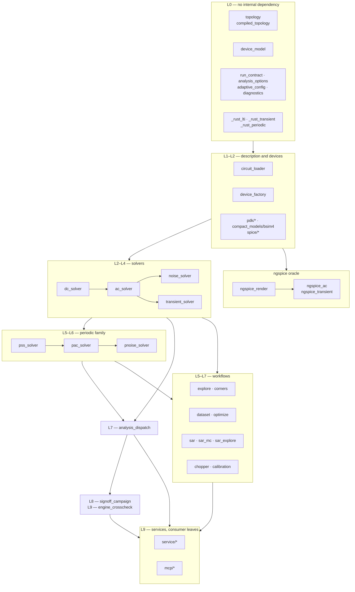

# Core Solver Overview

[Project overview](README.md) | [中文说明](README_zh.md) | [中文版](module_overview_zh.md)

> **Status: maintained architecture reference.** Module responsibilities and
> data flow are maintained; benchmark and calibration numbers near the end are
> dated snapshots and should be reproduced before use in a new report.

This document introduces the current `circuitopt/` solver stack. It is a local
analog-circuit simulation and optimization framework spanning the AT4000TG
analytic model and native BSIM4-backed SKY130, FreePDK45, and TSMC28 flows.

## Scope

The current solver stack covers:

- DC operating-point solving.
- AC small-signal gain and bandwidth analysis.
- Noise analysis, including flicker noise and thermal noise.
- Transient response simulation.
- Periodic steady-state (PSS) shooting for periodic transient orbits.
- PSS-assisted PAC (periodic AC) via analytic-adjoint harmonic balance (default),
  opt-in time-domain Floquet shooting, or finite-difference shooting.
- Periodic PNoise, with harmonic-balance and time-domain Floquet-adjoint paths
  plus cyclostationary noise folding.
- Process-corner and per-device mismatch perturbations.
- Cadence/Spectre-oriented validation for operating point, AC, noise, transient,
  PSS, PAC, and PNoise behavior.

The implementation is intentionally small and self-contained. Its modules include
`__init__.py`, the CLI entry `__main__.py`,
calibration/PSF/Cadence-netlist helpers, shared diagnostics/profiling
modules, the main solver stack, an ML-surrogate layer (dataset builder, surrogate
training, screen-and-verify optimizer), three silicon PDKs — SKY130 (via bundled
resolved cards and native Berkeley BSIM4.5), FreePDK45 (via a flat-card loader and native Berkeley
BSIM4.5), and TSMC28HPC+ (via the internal HSPICE parser and the same native backend) — plugged into the
same `TransistorModel` interface as the original AT4000TG OTFT model, and an
optional local HTTP service layer (`circuitopt/service/`) over the whole stack.

## File Structure

```text
circuitopt/
  topology.py          Circuit topology source of truth.
  compiled_topology.py Runtime-compiled topology/index/stamp metadata.
  circuit_loader.py    JSON circuit description loader.
  device_model.py      TransistorModel ABC + OtftParams + model factory/registry + PDK/polarity layer.
  device_factory.py    Device build/resolve layer (build_devices, get_ss_params) + corner routing
                        (OTFT CORNERS, silicon apply_silicon_corner). Leaf module: depends
                        only on device_model.
  pmos_tft_model.py    AT4000TG PMOS-OTFT compact-model implementation.
  ac_mna.py            MNA stamping primitives.
  ac_solver.py         Pure AC small-signal solver: DC operating point + AC response (ac_solve).
  dc_solver.py         DC solve fallback (bounded least squares) + AFE-specific symmetric DC
                        seeding/continuation heuristics.
  noise_solver.py      Noise propagation and input-referred noise analysis.
  transient_solver.py  Time-domain transient solver.
  transient_profile.py Shared transient/chopper analysis counter slots.
  pss_solver.py        Transient-shooting periodic steady-state solver.
  pac_solver.py        Generic PSS-assisted PAC solver.
  pnoise_solver.py     Generic PNoise solver (HB + TD adjoint).
  adaptive_config.py   Shared adaptive-step configuration types and helpers.
  analysis_dispatch.py JSON analysis-configuration dispatch entry point.
  analysis_options.py  Central solver-option registry for JSON dispatch.
  diagnostics.py       Thread-safe solver-fallback observer (counters + logging).
  psf.py               PSFASCII parser for Spectre reference data.
  calibration.py       Local-vs-Cadence calibration comparison helpers.
  cadence_netlist.py   Spectre netlist generation helpers for validation runs.
  chopper.py           Ideal and PMOS-switch differential chopper analyses.
  explore.py           Design-space exploration / optimization driver.
  corners.py           Process corners, mismatch MC, and latch detection.
  dataset.py           Labeled surrogate-training dataset builder (provenance + failure-retaining).
  surrogate.py         Baseline metric surrogate (GBT via optional scikit-learn) + region-of-interest filtering.
  surrogate_torch.py   Differentiable surrogate (torch/MPS) + gradient-based design optimization.
  optimize.py          Screen-with-surrogate / Pareto-select / verify-with-solver optimization loop.
  sky130_model.py      SKY130 compatibility exports + explicit ngspice card-extraction utility.
  ngspice_char.py      Model-card evaluator: batch ngspice .dc/.noise characterization → cached (Vsb,Vds,Vgs) grid.
  ngspice_device.py    TransistorModel over a cached ngspice grid (interpolated Id/gm/gds/caps/noise; extract_w + temperature).
  ngspice_process.py   Process-adapter protocol: deck preamble, instance syntax, op vectors, simulator flags.
  freepdk45_model.py   FreePDK45 compatibility exports + explicit ngspice oracle registration.
  pdk/freepdk45/       Flat-card loader and native FreePDK45 nmos/pmos adapter.
  pdk/sky130/          Bundled resolved-card loader and native SKY130 nmos/pmos adapter.
  compact_models/bsim4/ Native Berkeley BSIM4 host, ABI, and the ctypes bridge into the compiled Rust core.
  tsmc28_model.py      TSMC28HPC+ core nmos/pmos binding: nch_mac/pch_mac + HSPICE library closure.
  service/             Optional local FastAPI HTTP service layer (the `serve` extra) — see below.
    __init__.py        Re-exports CLI glue only; never imports fastapi (import circuitopt stays fastapi-free).
    app.py             create_app() — /api/v1 routes (health/capabilities/validate/solve/jobs/*); thin adapter, no numerics.
    operations.py      Transport-neutral capabilities/validate/solve operations shared by HTTP and MCP.
    jobs.py            Extensible in-process thread-pool jobs with progress queue + cooperative cancel.
    serialize.py        to_jsonable()/serialize_results() — numpy/complex/NaN → strict-JSON conventions.
    cli.py              add_cli_args()/run_cli() — shared `serve` subcommand argument wiring (lazy fastapi/uvicorn import).
  mcp/                 Optional stdio/Streamable HTTP MCP adapter (the `mcp` extra).
    server.py          MCPServer tools/resources, bounded results, and background signoff adapter.
    workspace.py       Workspace-relative input validation and atomic result artifacts.
    cli.py             Shared `mcp` subcommand and standalone entry-point arguments.
```

## Import Relationship

Module-level imports form a directed acyclic graph ten layers deep. The diagram
groups those layers; the exhaustive edge list follows it.



Two properties of this graph are worth stating, because both are load-bearing:

- **`explore`, `corners`, `dataset` and `chopper` reach the solvers directly**, not
  through `analysis_dispatch`. Dispatch drives one circuit through a configured
  analysis suite; those four drive a candidate matrix and need the solvers raw.
- **`service/` and `mcp/` are pure consumer leaves.** Nothing outside them imports
  back in, and `circuitopt/__init__.py` never imports either, so plain
  `import circuitopt` stays fastapi-free even with the `serve` extra installed.

The exhaustive list below records module-level imports only. Two pairs —
`run_contract`/`dc_measurements` and `sar`/`sar_rust` — also import each other from
inside functions; that is the deliberate way to break an import cycle in Python and
is why the module-level graph stays acyclic.

```text
topology.py            <- no internal dependency
compiled_topology.py   <- no internal dependency; consumes Topology-like objects at runtime
device_model.py        <- no internal dependency (abc, dataclasses only)
ac_mna.py              <- no internal dependency
run_contract.py        <- no internal dependency (dc_measurements imported lazily)
analysis_options.py    <- no internal dependency (registry)
adaptive_config.py     <- no internal dependency (dataclass only)
transient_profile.py   <- no internal dependency (counter slot constants)
diagnostics.py         <- no internal dependency (thread-safe counters)
psf.py                 <- no internal dependency
adc.py                 <- no internal dependency
frequency_metrics.py   <- no internal dependency
passive_bom.py         <- no internal dependency
toolchain.py           <- no internal dependency
surrogate.py           <- no internal dependency; optional scikit-learn/joblib at runtime
_engine.py             <- no internal dependency
_parallel.py           <- no internal dependency
_rust_lti.py           <- no internal dependency (serialization bridge)
_rust_transient.py     <- no internal dependency (serialization bridge)
_rust_periodic.py      <- no internal dependency (serialization bridge)
spice/parser.py        <- no internal dependency
spice/expressions.py   <- no internal dependency
spice/elaborator.py    <- spice/parser, spice/expressions
circuit_loader.py      <- topology, device_model
device_factory.py      <- device_model, run_contract (leaf device layer; no solver/workflow imports)
dc_measurements.py     <- run_contract
pmos_tft_model.py      <- device_model (equations in circuitopt_core.OtftModel)
cadence_netlist.py     <- topology
_campaign_sweep.py     <- _engine
compact_models/bsim4/abi.py         <- no internal dependency
compact_models/bsim4/card_cache.py  <- no internal dependency
compact_models/bsim4/native.py      <- compact_models/bsim4/abi
compact_models/bsim4/rust_transient.py <- _rust_transient, compiled_topology, bsim4/native
compact_models/bsim4/transient.py   <- adaptive_config, compiled_topology, device_factory
pdk/<name>/library.py  <- compact_models/bsim4, spice, toolchain
pdk/<name>/device.py   <- compact_models/bsim4, device_model, pdk/<name>/library
sky130_model.py        <- pdk/sky130, toolchain
freepdk45_model.py     <- pdk/freepdk45, device_model, ngspice_device
tsmc28_model.py        <- device_model, ngspice_device, ngspice_process, toolchain
ngspice_char.py        <- toolchain; ngspice subprocess + numpy only
ngspice_process.py     <- device_model
ngspice_device.py      <- device_model, ngspice_char; optional scipy at runtime
ngspice_render.py      <- device_factory, freepdk45_model, ngspice_process, toolchain
ngspice_ac.py          <- device_factory, ngspice_char, ngspice_render
ngspice_transient.py   <- device_factory, ngspice_char, ngspice_render
dc_solver.py           <- device_factory, topology
ac_solver.py           <- compiled_topology, dc_solver, device_factory, run_contract, topology
noise_solver.py        <- ac_solver, compiled_topology, device_factory, device_model, run_contract, topology
transient_solver.py    <- ac_solver, adaptive_config, compiled_topology, device_factory, topology, transient_profile
pss_solver.py          <- ac_mna, ac_solver, adaptive_config, device_factory, topology, transient_solver
pac_solver.py          <- ac_mna, ac_solver, device_factory, topology, transient_solver
pnoise_solver.py       <- ac_mna, device_factory, noise_solver, pac_solver, run_contract
analysis_dispatch.py   <- ac_solver, noise_solver, transient_solver, pss_solver, pac_solver,
                          pnoise_solver, circuit_loader, analysis_options, adaptive_config, run_contract
calibration.py         <- ac_solver, adaptive_config, noise_solver
chopper.py             <- ac_solver, dc_solver, device_factory, device_model, adaptive_config,
                          noise_solver, pss_solver, pac_solver, pnoise_solver, topology, transient_solver
explore.py             <- ac_solver, circuit_loader, device_factory, frequency_metrics, noise_solver, run_contract
corners.py             <- _campaign_sweep, _parallel, ac_solver, circuit_loader, device_factory,
                          noise_solver, run_contract, topology
dataset.py             <- circuit_loader, device_factory, device_model, explore, run_contract, transient_solver
optimize.py            <- circuit_loader, dataset, device_factory, explore
surrogate_torch.py     <- surrogate (dataset lazily, CLI only); optional torch at runtime
_rust_campaign.py      <- compiled_topology, device_factory, topology
sar.py                 <- _parallel, adc, circuit_loader, transient_solver
sar_mc.py              <- _parallel, adc, circuit_loader, sar
sar_rust.py            <- _rust_transient, compiled_topology, device_factory, sar, transient_solver
sar_explore.py         <- adc, circuit_loader, explore, sar, sar_mc
signoff_campaign.py    <- _parallel, analysis_dispatch, circuit_loader, compact_models/bsim4, run_contract
engine_crosscheck.py   <- analysis_dispatch, circuit_loader, compact_models/bsim4, device_model, signoff_campaign
service/serialize.py   <- no internal dependency; numpy only
service/jobs.py        <- corners, explore, service/serialize; no fastapi (pure threading/queue)
service/operations.py  <- analysis_dispatch, analysis_options, circuit_loader, device_factory,
                          device_model, freepdk45_model, run_contract, service/jobs, service/serialize
service/app.py         <- service/operations, service/jobs; optional fastapi/pydantic at import time
service/cli.py         <- service/app (lazy); optional uvicorn at runtime
mcp/workspace.py       <- no internal dependency
mcp/server.py          <- mcp/workspace, service/operations, service/jobs, service/serialize,
                          signoff_campaign; optional mcp SDK at import time
mcp/cli.py             <- mcp/server (lazy)
```

## Main Components

### `pmos_tft_model.py`

Implements the AT4000TG PMOS-OTFT compact model in Python. It provides:

- Terminal current evaluation through `get_Idc`.
- Drain-current noise PSD through `get_noise_psd`.
- Bias-dependent terminal capacitances through `get_capacitances`.
- Geometry area calculation through `g_area`.
- Process and mismatch parameters such as `pvt0`, `mvt0`, `pbeta0`, and `mbeta0`.
- A warm-started internal-node operating point solve.
- Compiled scalar kernels: the device equations evaluate in
  `circuitopt_core.OtftModel` (the sole engine as of v2.0.0).

For AC and noise analysis, the solver extracts terminal `gm` and `gds` by finite-differencing `get_Idc`, matching the terminal behavior used by the circuit solver.

`PMOS_TFT` inherits from :class:`~device_model.TransistorModel`, the abstract
base class consumed by all solvers. It also provides `get_otft_params()` for the
transient solver’s compiled inner loop and a `get_ss_params()` override backed by
the compiled Rust core’s analytic terminal derivatives.

### `device_model.py`

Defines the abstract device‑model interface that decouples solvers from concrete transistor implementations:

- **`TransistorModel` (ABC)** — seven abstract methods (`get_Idc`, `get_op`, `get_capacitances`, `get_capacitance_charges_from_op`, `get_capacitance_branch_terms_from_op`, `get_noise_psd`, `get_otft_params`); `get_ss_params` provides a finite‑difference default that subclasses can override.
- **`OtftParams` (frozen dataclass)** — the 16 scalar parameters extracted once per device and passed to the compiled transient kernels.
- **Backend-capability class attributes** — generic solvers dispatch on *capabilities*, never on a concrete backend type. `HAS_TERMINAL_LINEARIZATION` (default `False`) advertises the full quasi-static 4×4 terminal `(G, C)` stamp used by AC/PAC/PNoise; native BSIM devices set it to `True`. `TRANSIENT_BACKEND` (default `None`, meaning the selected engine's generic OTFT transient path) names a specialised integrator such as `"bsim4_native"` or an explicit external oracle backend.
- **`register_model()` / `create_device()` + PDK/polarity layer** — the factory and
  registry described below.

**Registry keys.** Each `(pdk, polarity)` pair registers under a structured key
`"<pdk>.<polarity>"`, for example `"at4000tg.pmos"`. `register_pdk()` groups one
process's polarities and marks the default. `"pmos_tft"` stays a back-compat alias.

**Single switch point.** Solver files call `create_device(get_default_model_type(), …)`
instead of hardcoding a model name, so a new process or an `nmos` polarity slots in
with one `register_pdk` call and no solver edits.

**Read access.** `get_model_class(model_type)` is a public read-only accessor, so a
solver can inspect a model's capability flags without importing a concrete backend
class. `registered_models()` returns a read-only `{model_type: "module.QualName"}`
snapshot of the whole registry in insertion order, for callers that need to
*enumerate* rather than look up one entry; the service layer's
`GET /api/v1/capabilities` uses it to list every selectable model key.

**Out of scope.** Generic elements — resistors, capacitors, ideal voltage and current
sources, controlled sources — are process-independent topology primitives and are
**not** in this registry, so every PDK reuses them unchanged.

**Collisions.** `register_model()` replaces an existing entry on re-registration, which
keeps an intentional swap-in such as a test stub working silently. A genuine collision
— a different class, compared by `__module__.__qualname__`, taking over an occupied
name, for instance two PDK modules racing for the same alias — emits a `RuntimeWarning`
before overwriting. A repeat import or `importlib.reload` of the *same* class stays
silent.

### `device_factory.py`

The leaf device-build layer: it depends only on `device_model` (never on any solver or workflow
module), so every solver can import it without risking a cycle.

- **`build_devices(sizes, *, nf=None, corner=None, topo, model_types=None, device_kwargs=None)`** /
  **`get_ss_params(...)`** — turn the per-device inputs a solver already carries (sizes, NF, corner,
  `model_types`, `device_kwargs`) into concrete `TransistorModel` instances, migrated here from
  `ac_solver.py` unchanged. `dev_corner`/`dev_nf`/`is_per_device_corner` are the small per-device
  corner/NF resolution helpers behind them.
- **`CORNERS`** — the OTFT continuous-PVT global process shift dict (`typical`/`slow`/`fast` as
  `pvt0`/`pbeta0`), migrated here from `corners.py`; `corners.py` now imports it from here instead of
  defining it.
- **`SKY130_CORNERS`** / **`SILICON_CORNERS`** / **`apply_silicon_corner(model_types, device_kwargs,
  corner)`** — the silicon discrete-corner routing that stamps a corner name (`tt`/`ss`/`ff`/`sf`/`fs`
  for SKY130, plus `nom` for FreePDK45) onto extracted silicon device cards, migrated here from
  `explore.py`; `explore.py` and `dataset.py` now import it from here instead of defining it.
- **`CircuitBinding`** — a frozen dataclass bundling the six per-circuit inputs every solver used to
  thread by hand: `topo` / `model_types` / `device_kwargs` / `nf` / `corner` / `dc_seed`. It exists to
  close a bug class: dropping `model_types`/`device_kwargs` on the way into a solver silently reverted
  the circuit to the default OTFT PDK. A caller now passes `binding=` once instead of re-plumbing the
  cluster. Build one from `CircuitSpec.binding()` (see `circuit_loader.py`). `binding.build(sizes)`
  materializes `{name: TransistorModel}` for those sizes; `binding.at_corner(corner)` returns a binding
  routed to a corner — a silicon corner is baked onto `device_kwargs` (solver corner cleared, via
  `apply_silicon_corner`), an OTFT corner stays on `binding.corner`, and `None` returns `self`.
  **Resolution priority** (via `resolve_binding`): an explicit non-`None` keyword to a solver always
  wins; otherwise the binding field supplies the default (`binding.dc_seed` backs `x0_guess`); with
  `binding=None` the legacy kwargs path is byte-identical. All six solver entry points
  (`ac_solve`/`noise_analysis`/`transient`/`pss_solve`/`pac_solve`/`pnoise_solve`) accept `binding=`,
  and the internal workflows — `analysis_dispatch.run_analysis_suite`, `explore`, `dataset`,
  `optimize` — thread one binding rather than re-forwarding the model cluster to each branch.

### `topology.py`

Defines the circuit topology as the single source of truth. The topology contains the transistor list, solved node list, rail/bias nodes, outputs, AC input drives, load capacitors, transient input mapping, DC guesses, and DC aliases. Solver runtime metadata is derived from this topology instead of being hand-written separately in each solver.

Alongside the transistors it also carries passive and source elements. None of them
touch the transistor model machinery.

| Element | Fields | Semantics |
| --- | --- | --- |
| `resistors` | a, b, R | Resistance in ohms. |
| `capacitors` | a, b, C | Capacitance in farads. |
| `isources` | nplus, nminus, I | Ideal DC current source, I flows nplus → nminus. |
| `vsources` | p, q, value | Ideal voltage source, true MNA. |
| `vccs` | p, q, ctrl_p, ctrl_n, gm | Voltage-controlled current source. |
| `vcvs` | p, q, cp, cn, mu | Voltage-controlled voltage source, `Vp−Vq = μ(Vcp−Vcn)`. |
| `cccs` | p, q, ctrl_name, beta | Current-controlled current source, `Iout = β·Ictrl`. |
| `ccvs` | p, q, ctrl_name, gamma | Current-controlled voltage source, `Vp−Vq = γ·Ictrl`. |

Each vsource, VCVS and CCVS adds one branch-current unknown and one constraint row,
growing the system from `n` to `n_aug = n + m`. CCCS and CCVS can cascade: either may
control on the branch current of any vsource, VCVS or CCVS.

The elements flow through every analysis:

- **DC** — resistor branch currents and current-source injections enter the KCL.
- **AC** — resistors stamp as `1/R`, capacitors as `jωC`, VCCS as `gm*(Vcp-Vcn)`,
  VCVS/CCVS/vsource as a bordered `[[Y,B],[B^T,0]]` block with their constraint rows,
  and CCCS as a coupling into the KCL rows. Current sources are open circuits in the
  small-signal system.
- **Noise** — resistors add `4kT/R` thermal noise. All controlled sources and ideal
  voltage sources are noiseless.
- **Transient** — resistor conductances, capacitor companions, constant/VCCS/CCCS
  source currents, and VCVS/CCVS/vsource branch-current unknowns with their constraint
  equations.

The default topology is `AFE_TOPO`, a 10-transistor fully differential AFE core with tail current device, input pair, output stage, and cross-coupled positive-feedback level shifting devices.

### `compiled_topology.py`

Builds a runtime plan from a declarative `Topology` and a bias/input context. It resolves node names once into compact terminal tokens and exposes shared metadata for DC, AC/noise, and transient:

- solved-node indices and rail values;
- per-device drain/gate/source terminal tokens;
- resistor, capacitor, current-source, VCCS, VCVS, CCCS, and CCVS stamp metadata;
- AC/noise `("n", idx)` / `("v", value)` terminal tables;
- transient input and `node_inputs` mappings.

This keeps AC, noise, and transient on the same indexing/stamping convention while preserving the ability to swap in a different JSON-defined circuit.

It also hosts the small marshalling helpers `term_arrays()` (splits `(kind, ref_or_value)` terminal
tokens into parallel `kind`/`ref`/`value` int/float arrays) and `index_array()` (packs optional
integer indices into an int64 array, `None` → `-1`). The generic and native-BSIM
transient marshals build the same stamp-ready arrays from these, so the
helpers live with the topology tokens they share instead of being duplicated per backend.

### `circuit_loader.py`

Loads JSON circuit descriptions and returns a `CircuitSpec` containing:

- `topology`
- `sizes`
- `bias`
- `nf`

This lets new circuits be added through JSON files such as `examples/single_stage.json` without editing solver source code. `CircuitSpec.binding()` bundles the spec's `topology`, `model_types`, `device_kwargs`, `nf`, and default DC seed (its first dict `dc_guess`) into a `CircuitBinding` (see `device_factory.py`), so a workflow can pass `binding=` to the solvers instead of threading the whole cluster.

### `numba_kernels.py` (removed in v2.0.0/R7)

Historical: this module carried the pure-Python/numba `_impl` scalar and
transient kernels. The numba JIT went away in R6; in R7 the whole module was
deleted after its load-bearing part — the OTFT root-selection recovery oracle —
was ported bit-exactly into the compiled core as
`circuitopt_core.OtftModel(..., reference=True)` (selected by
`pmos_tft_model.otft_reference_mode`). The frozen golden corpus
(`tests/golden/engine_parity`) is the numerical reference oracle.

### `analysis_options.py` / `analysis_dispatch.py`

`analysis_options.py` is the central per-analysis option registry that
`analysis_dispatch.py`'s `run_analysis_suite` (and the JSON schema regression
test) both derive from, so solver kwargs/defaults/schema cannot silently drift
apart. `validate_analysis_cfg(analysis, cfg)` rejects residual keys in a JSON
`analyses` block: `known_keys(analysis)` unions the solver's option registry
with `DISPATCH_KEYS` (the handful of keys — e.g. `freqs`/`corner`/`band` for
`ac`/`noise`, `signed_devices` for `transient` — that `run_analysis_suite`
reads directly out of `cfg` rather than forwarding into `solver_kwargs`); any
key outside that union raises `ValueError` naming the analysis, the offending
key(s), and the sorted list of valid keys. This turns a typo (e.g.
`max_sidebands` for `max_sideband`) into an immediate error instead of a
silently-ignored option running with its default.

`ANALYSIS_ORDER = ("ac", "noise", "transient", "pss", "pac", "pnoise")` in
`analysis_dispatch.py` is the canonical analysis-name tuple and execution order;
`run_analysis_suite` iterates it, and the service layer's `GET
/api/v1/capabilities` builds its `analyses` map by iterating the same tuple, so
the two surfaces list identical analysis names with no separate hardcoded list.

### `psf.py`

`provenance(path)["fundamental"]` reads the PSF HEADER's `"fundamental
frequency"` key (falling back to the bare `"fundamental"` spelling for any
non-standard writer) — periodic analyses (PAC/PNoise/PSS) report their real
drive frequency; DC/AC/noise/tran carry neither key and read back `None`.
`parse_noise(path)`'s per-device noise arrays are **ragged**: the column count
follows each device's TYPE-declared struct width (a MOSFET's `(flicker,
thermal, total)` struct is width 3; a resistor's `(rn, total)` struct is width
2), so callers must read the *last* column (`[:, -1]`) for the total
contribution and check `.shape[1]` before slicing a specific field — never
assume width 3.

### `ac_mna.py`

Provides the low-level MNA stamping primitives used by the small-signal solvers:

- Admittance stamping.
- VCCS, VCVS, CCCS, and CCVS stamping.
- Ideal voltage source stamping (bordered MNA).
- MOS small-signal stamping.

### `ac_solver.py`

Solves the DC operating point and AC response:

- `ac_solve(sizes, bias, freqs, corner=None, x0_guess=None, topo=AFE_TOPO, nf=None)`
- Uses `scipy.fsolve` for the DC node equations.
- Returns gain, bandwidth, node operating point, and extracted small-signal parameters.
- Supports both global process corners and per-device mismatch maps.
- Uses topology metadata for output sensing, load capacitance, and AC input drive.

The DC solve includes robustness handling for physical branch selection, symmetric operating points,
and rail-bounded node solutions — implemented in `dc_solver.py` and called from here. `ac_solver.py`
itself is now a pure AC small-signal module: `ac_solve` plus the `bw_from_gain` bandwidth helper. It
no longer carries the device-factory or DC-seeding code it used to.

### `dc_solver.py`

DC operating-point solving support that used to live inline in `ac_solver.py`, split out because it
mixes two different concerns:

- **`bounded_least_squares_dc(...)`** / **`dc_residual_ok(...)`** — a generic last-resort DC solve:
  a bounded least-squares fallback used when the primary Newton/`fsolve` path fails to converge, plus
  the residual-acceptance check that gates it.
- **`symmetric_seed(...)`** / **`symmetric_continuation(...)`** / **`is_afe_topology(...)`** /
  **`is_pairwise_symmetric_afe(...)`** / **`_AFE_SYMMETRIC_PAIRS`** — a circuit-specific seeding
  heuristic for the AFE topology only, **not** general solver logic. It selects the physical
  (Spectre-matching) symmetric power-up branch for that one circuit. Keeping it in its own module
  keeps `ac_solver.py`'s generic solve free of per-circuit branches.

### `noise_solver.py`

Performs noise propagation on the same topology-derived MNA system used by AC analysis. Each transistor drain-current noise source is injected between drain and source, propagated to the configured output, and divided by the signal gain to obtain input-referred noise.

The noise flow supports the same topology-derived terminal mapping and corner/mismatch parameter passing as the AC solver. In JSON dispatch, when AC and noise use the same frequency grid, noise reuses the prior AC `dc_op`, small-signal parameters, and gains instead of running DC/AC again; with different grids it still uses the AC `dc_op` as a warm seed.

### `chopper.py`

Computes gain, bandwidth, and baseband noise for chopper variants around the AFE:

- `chopper_analysis(...)` is the ideal synchronized differential chopper model.
  It treats the eight-switch commutator as +/-1 square-wave multipliers at the
  input and output, then folds sideband gain/noise back to baseband with odd
  harmonic coefficients. This is the linear periodically time-varying (LPTV)
  frequency-domain path for ideal chopping and flicker-noise movement.
- `build_afe_pmos_chopper(...)` inserts the eight switches as real `PMOS_TFT`
  pass devices around the AFE input/output ports.
- `pmos_chopper_analysis(...)` runs static phase A/B AC and noise on that PMOS
  switch topology and averages the phases. It includes switch Ron loading,
  nonlinear capacitance, and PMOS switch noise.
- `finite_edge_clock_pair(...)` and `finite_edge_chopper_harmonics(...)` model
  finite clock edge time and break-before-make dead time in the chopper waveform.
- `pmos_chopper_lptv_analysis(...)` folds the PMOS-switch sideband response/noise
  with those finite-edge harmonic weights. It is a fast **first-order** quasi-static
  estimate and underestimates the baseband gain by ~10% (it omits the higher-order
  LPTV conversion). For Cadence-grade gain/noise use the constant-free harmonic-
  balance path (`pmos_chopper_pss` → `pmos_chopper_pac`/`pmos_chopper_pnoise`). The
  old Cadence-fit conversion-phase / noise-PSD-scale constants were retired; the
  `conversion_phase_rad` / `periodic_noise_psd_scale` args remain as manual knobs.
- `pmos_chopper_transient(...)` drives the eight-PMOS topology with finite-edge
  clocks. The default clock follows Spectre `type=pulse` timing (`delay=T/2`,
  `width=T/2`, finite `rise/fall`), while the older centered phase waveform is
  still available with `clock_style="phase"` for dead-time experiments. Clock
  feedthrough comes from the PDK `Cgss/Cgdd * ddt()` terms and the long-timescale
  `R_cap2` gate-leak terms stamped by the transient solver; optional
  charge-injection pulses are estimated from the same PDK capacitance equations
  and stamped as time-varying current sources. The helper refines the internal
  time grid around clock edges, uses signed terminal currents for the eight
  bidirectional pass switches, and keeps a tight residual tolerance so slow
  common-mode charge balance is not lost.
- `pmos_chopper_pss(...)` wraps that same hard-switched topology in the generic
  shooting PSS solver and returns one periodic orbit for the selected clock
  period. This is the foundation for native PAC/PNoise. The wrapper defaults to
  `cap_mode="average"` for the orbit: a trapezoidal `0.5*(C_n+C_{n-1})*dV`
  discretization that matches Cadence's commutation feedthrough on the chopper's
  high-impedance internal nodes. Generic transient/PSS calls still default to
  the charge-conservative Q-stamp.
- `pmos_chopper_pac(...)` is a compatibility wrapper over the generic
  `circuitopt.pac_solver.pac_solve(...)`. The generic solver still defaults to the
  analytic-adjoint HB path, but the chopper wrapper defaults to the time-domain
  Floquet path (`method="pss_time_domain"`): it builds the one-period monodromy
  once in time domain, then solves a small quasi-periodic boundary system per
  frequency. For PMOS_TFT periodic conversion it retains each device's hidden
  `gate1` small-signal state (`R_cap`, `R_cap2`, `Cgs`, `Cgd`) instead of
  collapsing to terminal `{gm,gds,Cgs,Cgd}` at every orbit sample. The periodic
  conversion linearization uses the Verilog-A-style `C(V)*ddt(V)` operator that
  Spectre PAC folds, not necessarily the transient companion operator used to
  generate the large-signal orbit. When every PMOS device exposes the `gate1`
  network, the gate1-retained PAC linearization is assembled by the compiled Rust
  kernel (`circuitopt_core.PeriodicLinearizationProblem`); topologies it does not
  cover (controlled sources, bordered or vsource-driven systems) return early so
  the caller continues to the next path. Set `time_domain=False` for the analytic-adjoint HB
  comparison path, or `analytic=False` for the original finite-difference
  shooting path. Static PSS orbits automatically reduce to ordinary `ac_solve`,
  avoiding PAC transient runs.
- `pmos_chopper_pnoise(...)` is a compatibility wrapper over the generic
  `circuitopt.pnoise_solver.pnoise_solve(...)`. For chopper verification it defaults to
  the time-domain Floquet adjoint: solve the sparse periodic adjoint BVP
  directly, then reuse the existing cyclostationary device/resistor noise fold.
  This removes the HB-adjoint sideband-truncation error. The harmonic-balance
  PNoise path remains available with `time_domain=False`: sample periodic
  small-signal G(t)/C(t), FFT to Fourier coefficients, assemble
  `Y[kr,kc] = G_{kr-kc} + jω·C_{kr-kc}`, solve one adjoint system per baseband
  frequency, and fold noise to the baseband output. Unlike
  `pmos_chopper_lptv_analysis`, neither path needs a Cadence calibration factor.

The PMOS-switch sideband path was initially validated with
`pmos_chopper_lptv_analysis` paired with Cadence calibration constants. The
native `pmos_chopper_pac` and `pmos_chopper_pnoise` now replace those
calibration-dependent paths with first-principles periodic small-signal and
noise solves. The finite-edge transient path has been checked against Spectre
`tran`. For the D3 `chop_tb_d3` slow-corner PSS/PAC/PNoise reference, native
default time-domain PAC is about +0.03%, and native TD PNoise IRN is about
+0.02%. The old HB-K32 PNoise IRN errors across slow/typical/fast were
+1.81% / +1.05% / +0.66%; the TD-adjoint errors are +0.02% / -0.00% / +0.57%.
This closes the earlier false comfort from sideband truncation while remaining
first-principles.

### `pss_solver.py`

Solves periodic steady state by shooting on top of the existing transient
engine:

- `pss_solve(sizes, bias, period, topo=..., tgrid=..., inputs=..., node_inputs=...)`
- Integrates one period with `transient(...)` and solves `x(T)-x(0)=0`.
- Uses the DC operating point as the default seed, with optional stabilization
  periods before shooting.
- **Shooting Jacobian:** By default (`analytic_jacobian=True`), the first
  Jacobian is built analytically in one orbit pass: sample the small-signal
  G(t)/C(t) stamps at each converged trajectory step, form the per-step map
  A_m = (G_m + C_m/h)^{-1} · (C_m/h), and accumulate the monodromy matrix
  Φ = ∏ A_m. The shooting Jacobian is then Φ - I — O(1) orbit pass instead of
  `n_state` finite-difference period runs. Falls back to finite differences on
  failure. Set `analytic_jacobian=False` to use the original finite-difference
  path.
- After the first Jacobian build (analytic or FD), the solver reuses it with a
  Broyden secant update. This removes repeated Jacobian builds on later shooting
  iterations while still recomputing the true one-period residual for every
  accepted step. Use `jacobian_reuse=False` to rebuild every iteration, or set
  `jacobian_rebuild_interval` for periodic rebuilds.
- Returns the one-period trajectory, `x0`, `x_end`, residual vector/norm,
  convergence flag, iteration history, and performance counters such as
  `shooting_period_runs`, `shooting_jacobian_evals`, and
  `shooting_jacobian_reuses`. The history records the Jacobian kind used
  (`"analytic_monodromy"` or `"finite_difference"`).
- PMOS chopper wrappers default to the compiled Rust grid transient path
  (`fallback_least_squares=False`), one stabilization period, and the chopper-only
  `cap_mode="average"` orbit when they build a PSS internally for PAC/PNoise.
  This preserves the residual/nfail convergence checks while avoiding Python
  fallback reruns on every period.
- Chopper PSS auto-seeding caches the bare-AFE DC seed for identical
  size/bias/corner inputs. Repeated analyses reuse only the initial guess; the
  real shooting residual is still recomputed, so convergence accuracy is unchanged.

This PSS orbit can feed the generic `pac_solve` and `pnoise_solve` kernels
directly. `pmos_chopper_pac` / `pmos_chopper_pnoise` are wrappers that map the
chopper's differential input to `input_drive={"vip": 0.5, "vin": -0.5}`.

### `pac_solver.py`

- `pac_solve(sizes, bias, freqs, pss_result=..., input_drive=...)`
- Circuit-generic: it only requires the PSS result to carry `topology`, `t`,
  `nodes`, `x0`, `x_end`, `output`, and periodic input-waveform metadata.
- `input_drive` maps small-signal complex amplitudes to transient input keys,
  e.g. `{"vip": 0.5, "vin": -0.5}` for differential input or `{"vin": 1.0}`
  for single-ended input.
- Four performance paths, tried in order:
  1. **LTI fast path** — static PSS orbits reduce to ordinary `ac_solve`.
  2. **Time-domain Floquet PAC** (`time_domain=True`; chopper wrapper default) — samples
     periodic G(t)/C(t) and input coupling on a uniform orbit grid, builds the
     frequency-independent monodromy once, then solves
     `(exp(jωT)I - Ψ)x0 = g` per frequency. This avoids HB sideband truncation
     and the large `(2K+1)n` conversion matrix. PMOS_TFT devices are expanded
     with their internal `gate1` small-signal states during periodic conversion.
     The all-PMOS gate1 case uses the compiled Rust linearization kernel;
     unsupported mixed, bordered, or vsource-driven cases return `None` and
     continue to the next path.
  3. **Analytic-adjoint** (generic default, `analytic=True`) — samples periodic G(t)/C(t)
     and input-coupling columns G_in(t)/C_in(t) on the PSS orbit, FFTs to
     harmonic coefficients G_k/C_k, builds the harmonic-balance conversion
     matrix Y_HB(f), and reads sideband-0 gain from a single adjoint linear
     solve per frequency. Cost is O(1) per frequency with zero extra transient
     runs. Controlled by `n_period_samples` (time resolution) and `max_sideband`
     (sideband count).
  4. **Finite-difference shooting** (`analytic=False`) — finite-differences the
     state transition matrix Φ and the complex input forcing around the PSS
     orbit, then solves `(Φ-γI)dx0=-b`. Costs `n_state+2` transient runs per
     frequency. Cached on `pss_result` for repeated PAC/PNoise calls.
- Results include counters such as `pac_period_runs`, `pac_state_cache_hit`,
  `pac_input_cache_hits`, `pac_td_setup_time_s`, and `method`
  (`"pss_time_domain"`, `"pss_analytic_adjoint"`, or `"pss_fd_shooting"`).
  PAC condition diagnostics are off by default and are enabled only by
  `profile=True`, `debug=True`, or explicit `compute_condition=True`; the
  diagnostic does an SVD per frequency and does not affect gain/BW/noise.

### `pnoise_solver.py`

- `pnoise_solve(sizes, bias, freqs, pss_result=..., fundamental=...)`
- Uses generic `Topology` device/resistor/capacitor stamps. PMOS device noise is
  sampled along the PSS orbit; resistor thermal noise is folded as a stationary
  source.
- Static PSS orbits use the same LTI `noise_analysis` path as normal noise
  analysis. True LPTV runs cache sampled `G(t)/C(t)`, HB blocks, and
  identical-frequency adjoint solves on `pss_result` where the HB path is used.
- With `time_domain=True`, PNoise replaces the K-truncated HB adjoint solve with
  a sparse Floquet adjoint BVP (`pnoise_time_domain_used=True`). This is exact in
  the conversion sideband index; its remaining numerical error is the time-grid
  discretization, so default-like `n_period_samples < 640` is raised to 768.
  The returned `method` is `pss_time_domain_floquet_adjoint` on this path and
  `pss_harmonic_balance_conversion_matrix` on the HB fallback path.
- HB adjoint solves support `hb_solver="auto" | "dense" | "sparse" |
  "iterative"`. The default keeps small systems on dense BLAS/LAPACK and switches
  large, very sparse HB matrices to SciPy sparse direct solves. Forced
  `iterative` uses block-Jacobi preconditioned GMRES, with per-harmonic diagonal
  block LU factors, and falls back to sparse direct if convergence fails.
- HB block assembly, scalar `freq × source × sideband²` noise folding, OTFT
  orbit linearization, retained `gate1` dynamics, and generic four-terminal
  silicon G/C stamping run in the compiled Rust core (`circuitopt_core`) — the
  sole engine as of v2.0.0 (see `circuitopt/_engine.py`). Result flags
  `pnoise_rust_hb_used` / `pnoise_rust_fold_used` report whether the Rust fast
  path applied to a given call. Compiled code mainly helps the matrix-fill and
  noise-fold loops; HB linear solves are dominated by BLAS/LAPACK, SuperLU, or
  GMRES rather than Python loop overhead.
- If `gains` or `pac_result` are not provided, pass the same `input_drive` and
  the function will call generic `pac_solve` for input-referred noise.

### `transient_solver.py`

Solves the time-domain response of the topology-defined system using backward Euler (default) or variable-step BDF2/gear2 integration:

- `transient(sizes, bias, tgrid, vip=None, vin=None, nf=None, V0=None, topo=AFE_TOPO, inputs=None, node_inputs=None, integration_method="be", adaptive=False)`
- Supports legacy AFE `vip/vin` inputs and generic `inputs={name: waveform}` driven through `topo.transient_inputs`.
- `node_inputs={node: input_key}` drives a (rail) NODE with a waveform — used by a front-end testbench where the stimulus enters at source nodes and propagates through a passive network, rather than driving device gates directly.
- `current_inputs=[{"p": node_a, "q": node_b, "input": key}]` stamps a
  time-varying ideal current source flowing `p -> q`; the PMOS chopper helper uses
  this for charge-injection pulses.
- `cap_mode` / `cap_mode_id` are per-call capacitance-operator overrides.
  Production paths only support `charge`/id 0 and `average`/id 1. `None` uses
  the module/environment default (`charge`), while chopper PSS passes the
  `average` operator explicitly for Cadence-matched clock feedthrough. This
  override affects only the transient/PSS orbit, not PAC/PNoise conversion
  linearization.
- `adaptive=True` is an opt-in LTE-controlled gear2 path. It treats the supplied
  `tgrid` as the input-sampling grid and `[t0, tstop]` boundary, then returns a
  self-chosen non-uniform accepted grid. It is valid only with
  `integration_method="gear2"`. Public callers may still pass
  `adaptive_reltol`, `adaptive_vabstol`, `adaptive_iabstol`,
  `adaptive_max_steps`, and `adaptive_h0`; internally these are normalized into
  `AdaptiveConfig` and shared by transient/PSS/chopper paths. PSS additionally
  uses `adaptive_freeze_factor` from the same config.
  The adaptive LTE policy constants and Python helpers live in
  `circuitopt/adaptive_config.py`; the compiled Rust core (`co-core`) keeps a
  matching mirror, with tests checking the two implementations agree. Newton failure rejects now shrink
  the candidate step, while zero-error accepted steps may grow it.
- `max_step`, `max_retry_subdivisions`, `fallback_full_jacobian`, and
  `fallback_least_squares` provide
  controlled step refinement and bounded fallback solving for switched transient
  steps.
- Includes topology-defined load capacitances (and capacitor elements), plus resistor and ideal-current-source branches.
- Re-evaluates nonlinear capacitances during Newton iterations, and includes the
  PMOS `R_cap2` source/drain-to-gate leakage branch used by the PDK Verilog-A
  model.
- Supports `signed_devices` for bidirectional pass switches. The default AFE
  path keeps the historical `abs(Idc)` convention that matches the calibrated
  DC/AC/noise solvers, while switch devices can keep physical drain-current sign
  when source/drain voltages reverse.
- Uses the DC operating point from `ac_solve` as the default initial condition.
- Uses the compiled Rust transient Newton kernel (`circuitopt_core`, built via
  `_rust_transient.build_otft_transient_problem`). The compiled path evaluates
  PMOS operating points/capacitances, stamps the residual/Jacobian, solves the
  dense Newton step, and steps substep-to-substep entirely inside Rust; Python
  owns marshalling, dispatch, and result assembly only (`transient_solver.py`
  carries no per-step numeric loop of its own).
- With `profile=True`, native BSIM transient runs return
  `result["transient_profile"]` populated by counters inside the Rust hot loop:
  total Newton iterations, native BSIM evaluations and batch calls,
  solver/inserted step counts, failed-step count and expanded-grid indices, and
  measured solver wall time. Each Newton iteration resolves every MOS terminal
  tuple and calls `co_bsim4::eval_batch_into` once. Its persistent
  `EvalBatchWorkspace` reuses handle and status storage for the whole transient;
  the solver likewise reuses terminal rows and its I/G/Q/C evaluation slots.
  Rayon workers write those disjoint solver slots directly, with no temporary
  batch-result vector or adapter copy. The dedicated pool defaults to
  at most 10 workers and can be reduced with
  `CIRCUITOPT_BSIM_BATCH_THREADS=1..10`. Repeated cached handles are grouped
  onto one worker and evaluated serially; distinct handles remain parallel, so
  mutable compact-model state is never entered concurrently. A transient lease
  or campaign worker owns each such handle for the complete solve, so this hot
  path calls an internal lock-free evaluator. Public scalar/C ABI entries keep
  the per-handle mutex, and repeated handles in a batch stay serialized.
  Stamping remains deterministic.
  The pool is process-wide, so parallelism belongs to the outermost level: a
  driver already running solves concurrently (signoff PVT points, SAR
  conversions and Monte-Carlo trials, corner/PVT slices) has its workers
  evaluate batches inline and leaves the cores to that level. (SAR exploration
  no longer runs candidates concurrently — its `workers` go to each
  candidate's own conversion sweep, which lands on the "SAR conversions"
  case above.) This applies only when the outer work is at least as wide as the
  worker count, matching the compiled campaign's own axis rule, so a single
  solve keeps the pool. `CIRCUITOPT_BSIM_NESTED_POOL=1` restores the previous
  scheduling; results are unaffected either way. Every evaluation clears only
  the rows and columns of the fixed BSIM matrix frame through `CKTmaxEqNum`,
  which is the whole region the vendor stamps or reads;
  `CIRCUITOPT_BSIM_FULL_FRAME_CLEAR=1` forces the old full-frame write.
  Profiling disabled leaves these counters and the result field absent. The
  original `eval_batch` ABI remains as a compatibility wrapper.
- A native transient without an explicit `V0` first tries the topology's
  declared DC guesses through the same compiled topology, device wrappers, and
  leased handles used by the transient. A state is accepted only when Rust DC
  Newton converges to a finite residual within `dc_tol` and, when requested by
  the topology, remains inside its voltage box. Difficult points retain the
  complete `ac_solve` fallback. This avoids constructing the device set twice
  and avoids an unused 1 Hz small-signal reduction on the normal path.
- Accepted-state device-current and charge history reuses the final converged
  Newton `Evaluation` array. The convergence branch does not apply its
  sub-tolerance correction, so those I/G/Q/C values already match the accepted
  state. A failed step still refreshes the batch after its last state update.
  Consequently, a successful transient uses one initial-history batch plus one
  batch per Newton iteration, with no per-step accepted-state replay.
- Gear2 uses a guarded variable-step state predictor before each native BSIM
  Newton solve. Fixed grids use the two-state linear extrapolation
  `x[n] + h[n+1]/h[n] * (x[n] - x[n-1])`; adaptive Gear2 upgrades to the
  three-state variable-step quadratic extrapolation once that history exists
  and falls back to linear after a restart. Prediction rejects step growth
  above 4x and input-slope discontinuities, keeping clock and DAC edges on the
  previous accepted-state seed while accelerating smooth settling.
  `gear2_predictor_steps` records actual use in the transient profile;
  `CIRCUITOPT_BSIM_GEAR2_PREDICTOR=0` disables both modes for regression A/B.
- Native BSIM dispatch also implements `adaptive=True` entirely in Rust. Each
  trial performs one nonlinear Gear2 solve. A variable-step BDF3-minus-BDF2
  defect is formed from the accepted BSIM terminal-charge history and projected
  through the converged BDF2 Jacobian with one linear solve. That projection
  reuses the final Newton LU factors and solves only a second right-hand side;
  it does not stamp or factor the same Jacobian again. A PI controller
  shrinks on LTE or Newton rejection, caps growth at 2x, suppresses growth
  immediately after rejection, and restarts conservatively at input-slope
  breakpoints. LTE is formed over dynamic node voltages; ideal-source MNA branch
  currents are algebraic multipliers and are deliberately excluded. The
  returned `t` is the accepted non-uniform grid, and profiles add
  `accepted_steps`, `rejected_steps`, `trial_solves`, `lte_estimates`,
  `lte_linear_solves`, `lte_rejections`, and `newton_rejections`.
- For PSS-style non-robust runs (`fallback_least_squares=False` and
  `fallback_full_jacobian=False`), the compiled grid solver stays in Rust across
  the full period. Failed substeps are counted as failed intervals and the
  trajectory continues from the last accepted state, matching the non-throwing
  transient behavior without rerunning the whole period.
- Robust modes (least-squares or full finite-difference Jacobian recovery) are
  also compiled-core options passed in as call flags, applied only when
  requested — not a separate Python numeric path. `result["rust_grid_solver"]` /
  `result["rust_adaptive_solver"]` report which compiled path served a given
  call (the retired `numba_grid_solver` result key no longer exists; tests
  assert its absence rather than a `False` value).
- Uses implicit differentiation of the PMOS internal nodes for faster transient
  Jacobians, with finite-difference fallback.

**Gear2/BDF2 integration** (`integration_method="gear2"`): The transient solver
also supports variable-step BDF2 (second-order, stiffly stable). Key properties:

- Uses the stable charge-mode capacitor companion `i_n = (α0·Q_n + α1·Q_{n-1} +
  α2·Q_{n-2})/h_n`, same as BE's `(Q_n − Q_{n-1})/h` but with two-step history.
  A per-call cap-mode override exists for calibrated orbit generation; the PMOS
  chopper PSS wrapper uses the `average` operator to match Spectre feedthrough,
  while generic stiff circuits keep the charge default.
- Step-ratio clamp ρ≤2 guarantees zero-stability on non-uniform grids.
- BE self-start on the first step of every interval.
- A compiled Rust gear2 grid solver handles periodic PSS/PAC/PNoise orbits and
  raw-transient `max_step`, `flat_max_step`, and `max_retry_subdivisions`; the
  analytic gear2 monodromy (augmented 2n-state) feeds the PSS shooting Jacobian.
- The adaptive gear2 path uses a step-doubling LTE estimate and freezes the PSS
  grid near convergence before the final fixed-grid orbit/monodromy. The compiled
  core (`_solve_adaptive_rust`, the sole adaptive driver) accelerates it.
- PSS callers that need a reproducible PAC/PNoise orbit can pass
  `final_tgrid`. Adaptive Gear2 then performs stabilization only and never
  freezes its accepted grid. Shooting, analytic monodromy, fallback
  stabilization, profiling, and the returned trajectory all use the supplied
  deterministic grid. Analysis JSON exposes this mode as `final_n_points`;
  periodic pulse/square edge boundaries are inserted into both grids.
- Raw `transient(integration_method="gear2")` keeps the BE default opt-in
  boundary, but when `max_retry_subdivisions` or `max_step` asks for robustness
  it stays in the compiled Rust gear2 grid. The grid updates rolling two-step BDF2
  history after every accepted internal substep and retries failed substeps with
  fixed `2**max_retry_subdivisions` bisection. There is no separate Python
  numeric fallback in `transient_solver.py`; a rejected robust step raises
  instead.
- Chopper PSS/PAC/PNoise default to gear2 — PAC baseband errors drop from BE's
  −2.5% (typ/fast) to <1% across all three corners.
- Raw `transient()` still defaults to BE to preserve the established raw
  transient regression surface and first-order damping behavior. The default BE
  hard-switched chopper transient hot path is also fully compiled (Rust) now;
  normal runs no longer enter a Python tail or SciPy `least_squares`.

### Front-end stimulus (`ac_drives`)

For a testbench, the small-signal AC stimulus can be applied at NODES via `Topology.ac_drives` (e.g. `{"VINP": +0.5, "VINN": -0.5}`) instead of at device gates. The drive propagates through the passive front-end network to the (now solved) amplifier-input nodes, and the gain is normalized by the differential stimulus. In noise analysis these drives are treated as AC ground (inputs carry no signal). `examples/afe_testbench.py` builds the dry-electrode + AC-coupling front end (R_EL∥C_EL, C_AC series, R_AC to VCM) in front of the AFE core and runs AC (bandpass ≈ 0.05 Hz–few-hundred Hz), input-referred noise (including R_EL/R_AC thermal noise), and an in-band transient. Because the AC-coupled input makes the bare AFE DC multistable, the testbench seeds its DC solve from the robust bare-AFE operating point (`dc_seed`).

### `explore.py`

Design-space exploration / optimization driver built on top of the AC and noise
solvers — the "optimization" the project is named for. Given a circuit plus an
`explore` configuration (design variables with ranges, feasibility constraints,
and one or more objectives), it samples candidates, evaluates each through the
solvers, filters by constraints, and Pareto-selects the trade-off front.

- `explore(topo, base_sizes, base_bias, nf, cfg, n=, seed=, method=, corner=,
  workers=)` — run a sweep.
  `corner` applies a process shift (e.g. `CORNERS["slow"]`) to every evaluation, enabling
  corner-aware search without modifying the config. Eligible BSIM4 circuits use
  the topology-driven `CompiledCampaign`: arbitrary MOS connectivity, passive
  elements, independent/controlled sources, and augmented MNA branches are
  compiled once, then geometry/NF/bias candidates execute in cancellable chunks
  under one GIL-free Rayon pool. A multistable OTFT AFE uses
  the compiled path only when `seed_fn` supplies a consistent DC seed; cold AFE
  exploration stays on the scalar reference to avoid changing physical roots.
- `evaluate(topo, sizes, bias, nf, freqs, band, x0_guess=None, corner=None)` — single-candidate
  solver evaluation, now with optional corner/mismatch argument. During `explore`,
  evaluation is AC-first: gain/BW/power/area are computed before noise, failed
  candidates are rejected immediately, and noise runs only when `irn_uV` is
  required by a surviving candidate's constraints or objectives. The compiled
  BSIM path prepares DC, operating-point device linearization, the assembled MNA
  system, and the forward AC response once. A reusable `PreparedCampaign` then
  runs only the noise continuation for survivor indices; it does not repeat DC
  or forward AC. Native BSIM handles remain call-local and are re-biased at the
  retained operating point, so no C pointer crosses Python calls or Rayon workers.
- `load_explore_json(path)` — read an `explore` block from a full circuit JSON.
  The topology, device sizes, bias, and optional NF data are all loaded through
  the same JSON path; legacy `builtin_topology` configs are no longer accepted
  in the exploration layer.
- Sampling is `lhs` (Latin hypercube) or `random`, with a seeded RNG for repeatability.
- Metrics: `gain_dB`, `bw_Hz`, `irn_uV`, `power_uW` (the sum of solved source
  branch voltage-current products), and `area` (sum of per-device `g_area`).
- A variable's `targets` can drive several keys at once, keeping matched pairs
  (M7=M8, ...) identical so the AFE's symmetric DC continuation stays on the
  physical branch.
- Results export to CSV and JSONL; a CLI runs `python -m circuitopt.explore <config.json>`.
- Silicon corner routing (`SKY130_CORNERS`/`SILICON_CORNERS`/`apply_silicon_corner`) now lives in
  `device_factory.py`; `explore.py` imports it from there rather than defining it.
- `add_cli_args(parser)` / `run_cli(args)` are the single source of the CLI argument definitions —
  both the `python -m circuitopt explore` subcommand and the standalone `python -m circuitopt.explore` entry
  point call the same two functions, so the two surfaces cannot drift apart (see
  [`cli_reference.md`](cli_reference.md)).
- `explore_from_dict(data, n=, seed=, method=, corner=, workers=,
  progress=None, should_stop=None)` — the
  single shared entry point for the `explore` subcommand and the service layer's
  `POST /api/v1/jobs/explore`: parses the `explore` block, binds any silicon `models`, and calls
  `explore()`. `progress(done, total)` / `should_stop()` are optional hooks threaded straight
  through to `explore()` for a caller that needs live progress or cooperative cancellation (e.g.
  the service's background-job manager, see `service/jobs.py`); both default to `None`, in which
  case behavior is deterministic. Scalar runs check cancellation before every
  candidate; compiled runs check between bounded native chunks. On early stop, `results["stopped_early"]`
  and `results["summary"]["stopped_early"]` are `True` and `summary["evaluated"]` records how many
  candidates actually ran (`summary["n"]` stays the originally requested count).

Example configs: `examples/afe_explore.json` and `examples/single_stage.json`;
both are full circuit JSON files with an `explore` block.

### `corners.py`

Single source of truth for process-corner and robustness *work* — the pieces that
otherwise get re-derived in every sweep. The `CORNERS` data itself (global process shifts
`typical` / `slow` / `fast` as `pvt0`/`pbeta0`, from the PDK monte.scs sections; e.g.
slow = `{"pvt0": -0.2259, "pbeta0": -0.54}`) now lives in `device_factory.py`, the shared
leaf device layer; `corners.py` imports it from there (`from .device_factory import CORNERS`)
so existing `from circuitopt.corners import CORNERS` call sites keep working unchanged. What stays
in `corners.py` is the mismatch/latch machinery built on top of it:

- `mismatch_corner(rng, devices, base)` — per-device random `mvt0`/`mbeta0` on top of
  a process corner.
- `metrics(...)` — one design at one corner → `gain_peak_dB`, `bw_Hz`, `irn_uV`, and
  `latch_dV` (`|out+ - out-|` at the DC op; large ⇒ the cross-coupled positive feedback
  has latched).
- `corner_table(...)` — metrics across typ/slow/fast.
- `latch_screen(...)` — deterministic worst-case latch screen: pushes each symmetric
  pair ±kσ apart over ALL sign patterns and returns the largest output imbalance. A
  single fixed kick has false negatives (the latching sign pattern is design-dependent),
  so the screen scans patterns; cheap enough to use inside a search instead of a full MC.
  It skips noise because only the DC/AC operating point and latch imbalance are needed.
- `mismatch_mc(...)` — per-device mismatch MC at one corner, seeded from the nominal op;
  returns per-metric arrays, a latched mask, and a summary (latch rate + non-latched
  mean/std/P5/P95). Each sample is evaluated AC-first; IRN is computed only for
  non-latched samples included in the final noise statistics. Accepts optional
  `progress(i, n, partial)` / `should_stop()` hooks (default `None`, byte-identical result to the
  pre-hook code path): `progress` fires after each sample with a lightweight running summary,
  `should_stop` is checked before each sample and, if it returns `True`, ends the run early with
  `"stopped_early": True` on both the top level and `summary` — the count actually evaluated is
  `summary["n"]` (this path has no separate "requested n" field; unlike `explore`'s
  `summary["evaluated"]`, `mismatch_mc`'s `summary["n"]` always reflects samples actually run).
- `mismatch_mc_from_dict(data, n=, seed=, corner="typical", progress=None, should_stop=None)` — the
  shared entry point for the `mc` subcommand and the service layer's `POST /api/v1/jobs/mc`; parses
  the circuit and calls `mismatch_mc()` so the two surfaces can't drift.

`ac_solve` / `noise_analysis` accept the same `corner` argument (a flat process dict or a
per-device mismatch map). The driver `examples/mc_mismatch.py` wraps this into a corner
table + 3-corner MC figure.

### ML surrogate layer (`dataset.py` / `surrogate.py` / `surrogate_torch.py` / `optimize.py`)

Turns the validated solvers into a full **build dataset → train surrogate → optimize →
verify** loop. The solvers stay the ground truth throughout; the surrogate only
accelerates the *screening* of a large candidate pool.

- **`dataset.py`** — like `explore.py`'s sampling/evaluation but with **no** constraint
  or Pareto filtering and **always** evaluates noise, so every sample (including DC
  failures) becomes a labeled training row. Writes `.jsonl` (human-debuggable rows) +
  `.manifest.json` (provenance: schema version, solver git commit/dirty flag, topology
  hash, PDK, `models` binding, corner, sampling seed/method, variable ranges — so a
  consumer can reject out-of-domain designs) + `.npz` (dense `X`/`Y` matrices, NaN where
  a label is missing) + optional `.parquet`. **Label groups** (`--labels`, opt-in beyond
  the default `ac_noise`): `transient` (stimulus-agnostic waveform features from the
  config's validated periodic transient), `pss` (periodic-steady-state quality + orbit
  output), `pac` (baseband conversion gain + PAC-grid −3 dB corner) and `pnoise`
  (band-integrated output / input-referred periodic noise — the chopper figures of
  merit). The `pss`/`pac`/`pnoise` groups run one shared `run_analysis_suite` chain per
  candidate, so the config's validated `analyses` solver settings (`time_domain`,
  drive, band, shooting tolerances) apply exactly; `pac`/`pnoise` require their
  `analyses` blocks. **Design-axis grammar** extends beyond `DEV.W/.L/.NF`/bias:
  `<Cap>.C` / `<Res>.R` (named passive values — *structural*, rebuilds the circuit per
  candidate via `candidate_circuit()`), `periodic.frequency` (clock), and `pvt0`/`pbeta0`
  (continuous global process shift — sampling this turns the discrete corner sweep into
  a continuous-PVT training axis). Like `explore.py`, `dataset.py` imports silicon corner
  routing (`SKY130_CORNERS`, `apply_silicon_corner`) from `device_factory.py` rather than
  defining it, and exposes the same `add_cli_args(parser)` / `run_cli(args)` pair so the
  `python -m circuitopt dataset` subcommand and the standalone `python -m circuitopt.dataset` entry
  point share one argument definition.
- **`surrogate.py`** — `HistGradientBoostingRegressor` (optional `scikit-learn`
  dependency) trained per label, with automatic log-space fitting for labels spanning
  multiple decades (e.g. IRN). `filter_rows()` / CLI `--filter label:lo:hi` restricts
  training to a region of interest (e.g. drop railed/collapsed designs whose extreme
  labels would dominate a squared-error fit, and which get screened out by a constraint
  anyway). `score()` reports median/P95 relative error and R² per label.
- **`surrogate_torch.py`** — a differentiable MLP surrogate (optional `torch`
  dependency; MPS-capable on Apple Silicon) for gradient-based multi-objective design
  optimization with constraint penalties, plus a `--verify` pass back through the solver.
- **`optimize.py`** — the screen-and-verify payoff: predict a large pool (µs/candidate)
  with the surrogate, take the constrained Pareto front, then re-evaluate the top-K on
  the actual calibrated solver. Uses `dataset.candidate_circuit()`/`split_variables()` so
  every variable kind (including structural cap/resistor/clock axes) is honored in the
  verify pass, not just size/bias.

A key operational lesson: no single surrogate is both a
precise *region-of-interest* model and a good *failure-region-aware screener* — training
on the operating region (via `--filter`) gives the tightest metric accuracy but makes the
surrogate blind to railed designs during screening. The screen-and-verify architecture
tolerates this by design: the solver, not the surrogate, has the final word on feasibility.

### Silicon PDK and compact-model backends

The three silicon PDK adapters expose BSIM4 through the same `TransistorModel`
interface as the AT4000TG OTFT model. SKY130, FreePDK45, and TSMC28HPC+ all use
the in-process native Berkeley BSIM4 backend for normal DC, AC, noise, transient,
PSS, PAC, and PNoise operation.

`compact_models/bsim4/card_cache.py` provides their shared immutable-card cache.
The bounded, thread-safe LRU keys complete PDK/model/section/bin bindings,
geometry, NF/multiplicity, temperature, corner, mismatch, source fingerprint,
and adapter-specific instance fields. It caches only PDK/model/instance cards,
never mutable device objects or runtime terminal biases. Per-key single-flight
construction preserves parallel PVT work while preventing duplicate cold-card
elaboration; path/mtime/size fingerprints invalidate entries when a model source
is replaced.

`compact_models/bsim4/native.py` separately owns a bounded pool of
setup-complete mutable native handles. Each immutable card key may have several
handle slots so matched MOS instances can be evaluated concurrently without
sharing internal-node or limiting history. A solver leases every handle
exclusively for its complete trajectory and returns it afterward; the next
sequential solve can reuse the setup cost and warm history. Active handles are
never evicted. `BSIM4_DEVICE_CACHE_SIZE` limits the total number of handle slots
per PDK namespace (default 128), not the number of distinct card keys.
Immutable cards precompute their normalized, sorted parameter tuples at
construction, so repeated handle leases do not re-sort the full model card.
This changes only cache-key construction and is shared by SKY130, FreePDK45,
and TSMC28.

The TSMC28 MDAC signoff manifest deliberately sets `newton_vtol=3e-8 V` only
for its six adaptive residue/code-transition cases. The solver-wide default
remains `1e-8 V`; other circuits must opt in after their own trajectory and
signoff comparison. Those six cases also set
`bsim_model_bypass_tolerance=3e-9 V`, enabling the compact model's bounded
standard bypass during Newton. This option defaults to zero, may not exceed
`newton_vtol`, and is restored after every exclusive transient evaluation;
scalar analyses and regenerative SAR remain on the exact path.

- **`pdk/sky130/library.py` / `device.py`** — loads the bundled geometry-resolved
  BSIM4.5 cards and registers native `sky130.nmos` / `sky130.pmos`. `extract_w`
  selects a reference-width card while the instance keeps its actual geometry.
  Missing geometries fail clearly rather than launching an external simulator.
- **`sky130_model.py`** — compatibility exports plus the explicit
  `extract_sky130_card()` ngspice preparation utility. Normal simulation uses
  the bundled cards and does not call this extraction path.

A **third PDK, FreePDK45**, now uses the same native Berkeley BSIM4.5 kernel as
TSMC28HPC+. `pdk/freepdk45/library.py` parses each flat level-54 VTG card into a
numeric model card; `pdk/freepdk45/device.py` exposes four-terminal current,
conductance, charge, capacitance, and correlated noise through
`freepdk45.nmos` / `.pmos`. The source cards declare `version=4.0`; the bundled
Berkeley source treats that field as metadata, and regression tests compare
single-device operating points/noise plus a 5T OTA against ngspice.

The native host reduces the complete FreePDK45 internal drain/source, gate, and
body-resistance network with a small pivoted linear solve. One Schur
factorization serves all four external-terminal right-hand sides instead of
refactoring the same internal matrix for every row and column. Four-terminal
charge aggregation includes distributed body-junction charge and normalizes
PMOS charge signs, so AC capacitance and finite-difference charge derivatives
agree for both polarities. DC, AC, noise, transient, PSS, PAC, and PNoise
therefore share one in-process compact-model path.

Full evaluations feed
`acLoad` from the charge and small-signal fields produced by their final
floating-point model load, avoiding a duplicate `MODEINITSMSIG` load; set
`CIRCUITOPT_BSIM_REUSE_SMSIG_LOAD=0` to restore the legacy sequence.

The experimental `CIRCUITOPT_BSIM_REUSE_FINAL_LOAD=1` mode also lets a private-node
linearization whose Newton update is below 1 pV supply terminal reduction
directly. It remains opt-in because isolated scalar PDK points can move beyond
the public bit-level golden contract. Independently of that experimental mode,
the host always omits the reload when the solved private-node voltages are
bit-identical to those used by the current load (or no private nodes exist).
The external/internal node layout is cached after setup, so both optimizations
preserve the public bit-level result.

The compiled SAR single-trial path partitions input conversions into exactly
`min(workers, inputs)` balanced contiguous ranges; this prevents campaign Auto
from selecting its serial axis when ceil-sized chunks happen to produce fewer
ranges than workers. Within one conversion, the full stimulus is rendered once.
Each later bit updates only the newly active trial rows and, when needed, the
previous cleared-bit rows. Code-only sweeps omit terminal history, while detailed
conversions retain the complete accepted state/current/charge trajectory.

The native host also exports a versioned conserved-evaluation ABI, an all-`void *`
entry point, and a batch evaluator. `co_bsim4_set_card` applies a whole model or
instance card in one crossing, and the vendor keyword tables are indexed once per
process instead of scanned per parameter; a silicon card names hundreds of
parameters, so the two together are what keeps handle construction off the
critical path. The single-value `co_bsim4_set_model` / `co_bsim4_set_instance`
entries remain, and a parity test pins the whole-card path to them.
The fixed-grid BSIM4 transient runs matrix
assembly, Newton iteration, and time stepping inside the compiled Rust core
(`co-core` calling `co-bsim4` in-process); `compact_models/bsim4/native.py`'s
ctypes binding is the Python-facing entry point onto the same compiled library
for op-point/AC/noise device calls. There is no separate Python numeric
implementation in production as of v2.0.0.

- **`pdk/freepdk45/library.py`** — portable card resolution, strict binding,
  corner and polarity validation, numeric parsing, and shared immutable-card
  caching.
- **`pdk/freepdk45/device.py`** — native `TransistorModel` adapter and default
  `freepdk45.*` registration.
- **`freepdk45_model.py`** — compatibility exports and the optional historical
  `freepdk45_ngspice.*` grid aliases.
- **`ngspice_char.py` / `ngspice_device.py` / `ngspice_transient.py`** — retained
  external regression-oracle infrastructure, not the default FreePDK45 runtime.

### TSMC28HPC+ native adapter (`spice/` / `compact_models/bsim4/` / `pdk/tsmc28/`)

The internal HSPICE frontend resolves nested `.lib`/`.include` closures, parameters,
expressions, subcircuits, foundry MOS macros, and geometry bins. The TSMC28 library
layer selects the 0.9 V `nch_mac` / `pch_mac` core model for each instance and sends
the expanded model and instance parameters to the native Berkeley BSIM4.5 backend.

The native device exposes four-terminal currents, charges, conductance, capacitance,
and correlated noise. DC, AC, noise, transient, PSS, PAC, and PNoise therefore run
without an ngspice subprocess. The old process adapter remains registered only under
the explicit `tsmc28hpcp_ngspice.*` model names as an independent regression oracle.

The default portable model entry is
`PDK/tsmc28hpcp/models/hspice/cln28hpcp_1d8_elk_v1d0_2p2.l`, which is Git-ignored.
Resolution priority is `TSMC28_MODEL_DIR`, `TSMC28_PDK_ROOT`, that project-local
entry, then `PDK_ROOT/tsmc28hpcp`. See [TSMC28HPC+ Local Adapter](tsmc28hpcp.md).

`circuitopt/circuit_loader.py` requires every MOS in JSON to carry an explicit
`models` entry (`pdk`, `model`, `section`, and `bin`). A mixed OTFT/silicon
(or all-silicon) circuit is therefore just configuration; see
[JSON Circuit Description](json_circuit_format.md). Two complete fully-differential
OTA design walkthroughs: [SKY130 FD-OTA](sky130_fd_ota_design.md),
[FreePDK45 FD-OTA](freepdk45_fd_ota_design.md).

### Local service layer (`service/app.py` / `jobs.py` / `serialize.py` / `cli.py`)

An **optional** local FastAPI HTTP layer over the whole solver stack, gated on the
`serve` extra (`pip install -e ".[serve]"`). It is a thin adapter — every route hands
a request to the transport-neutral operations in `service/operations.py` and
carries no numerical logic of its own. Full endpoint reference:
[Service API](service_api.md).

- **`app.py`** — `create_app(job_workers=1) -> FastAPI` builds the `/api/v1` app:
  `GET health`/`capabilities`, `POST validate`/`solve` (synchronous, calling
  `circuit_from_dict`/`validate_analysis_cfg`/`run_analysis_suite` directly), and the
  `jobs/*` background-task routes (`POST jobs/explore`/`jobs/mc`, `GET jobs`/`jobs/{id}`,
  `DELETE jobs/{id}`, `WS jobs/{id}/events`) backed by `jobs.JobManager`. CORS is
  restricted to `localhost`/`127.0.0.1` on any port. `pydantic` request models
  (`SolveRequest`/`ExploreJobRequest`/`McJobRequest`) wrap `circuit` as an opaque
  `dict` — the circuit schema's single source of truth stays `circuit_from_dict`,
  never re-described here.
- **`jobs.py`** — `JobManager`/`Job`: an in-process `ThreadPoolExecutor`-backed
  background-job table for the two long-running drivers, `explore_from_dict` and
  `mismatch_mc_from_dict`. State machine `queued -> running -> {done, failed,
  cancelled}`; progress is pushed onto a per-job `queue.Queue` (drained by the
  WebSocket route) and also cached on `Job.progress` for polling; cancellation sets a
  `threading.Event` consumed as the `should_stop` callback passed into the core driver
  (cooperative — an in-flight candidate/sample always finishes first). Retains at most
  `MAX_JOBS` (50) jobs, evicting the oldest already-terminal one first. Imports no
  `fastapi` — pure threading/queue plumbing, unit-testable standalone.
- **`serialize.py`** — `to_jsonable()`/`serialize_results()`: the numpy/complex/NaN →
  strict-JSON conventions shared by every response (both the synchronous endpoints and
  the job/WebSocket payloads). NaN/±Inf → `null`, `complex` → `{"re", "im"}`,
  `numpy.ndarray` → nested `list`, `_`-prefixed dict keys and callables dropped.
- **`cli.py`** — `add_cli_args(parser)`/`run_cli(args)`, the single source of the
  `serve` subcommand's argument wiring (`--host`/`--port`/`--reload`/`--job-workers`),
  shared by the `circuit-opt serve` subcommand and the standalone
  `python -m circuitopt.service` entry point, mirroring the `explore`/`dataset`
  single-source CLI pattern. Imports `fastapi`/`uvicorn` lazily inside `run_cli`, so
  importing `circuitopt.service` (which `circuitopt/__main__.py` does eagerly for
  subcommand registration) never requires the extra to be installed.

### MCP layer (`mcp/server.py` / `workspace.py` / `cli.py`)

The optional MCP adapter is gated on `pip install -e ".[mcp]"` and exposes
stdio plus loopback-only Streamable HTTP transports. It calls the same
`service.operations` functions as FastAPI, adds workspace-confined relative
paths, compacts long vectors in direct tool responses, and writes complete
artifacts under `results/mcp`. Exploration, mismatch MC, and signoff are
cancellable `JobManager` jobs. Full tool and resource reference:
[MCP Server](mcp_server.md).

## Quick Example

```python
import numpy as np

from circuitopt.ac_solver import ac_solve
from circuitopt.noise_solver import noise_analysis, band_rms
from circuitopt.transient_solver import transient

sizes = {
    "M6": (2264, 78),
    "M7": (61365, 61),
    "M8": (61365, 61),
    "M9": (3175, 468),
    "M10": (3175, 468),
    "M11": (465, 66),
    "M12": (894, 85),
    "M13": (894, 85),
    "M14": (5224, 46),
    "M15": (5224, 46),
}

bias = {
    "VDD": 40.0,
    "VCM": 30.65,
    "VB": 9.84,
    "VC": 16.0,
}

freqs = np.logspace(-2, 4, 121)

ac = ac_solve(sizes, bias, freqs)
noise = noise_analysis(sizes, bias, freqs)
irn_uv = band_rms(freqs, noise["irn_psd"], 0.05, 100) * 1e6

t = np.linspace(0, 4e-3, 400)
vip = np.where(t >= 0.5e-3, bias["VCM"] + 0.5e-3, bias["VCM"])
vin = np.where(t >= 0.5e-3, bias["VCM"] - 0.5e-3, bias["VCM"])
tran = transient(sizes, bias, t, vip, vin)
```

## JSON Circuit Example

New circuits can be loaded from JSON. The field-level format is documented in
[JSON 电路描述格式](json_circuit_format_zh.md).

```python
import numpy as np

from circuitopt.circuit_loader import load_circuit_json
from circuitopt.ac_solver import ac_solve
from circuitopt.transient_solver import transient

spec = load_circuit_json("examples/single_stage.json")
freqs = np.logspace(0, 4, 121)

ac = ac_solve(spec.sizes, spec.bias, freqs, topo=spec.topology, nf=spec.nf)

t = np.linspace(0, 1e-3, 100)
vin = np.full_like(t, spec.bias["VIN"])
tran = transient(spec.sizes, spec.bias, t, topo=spec.topology,
                 nf=spec.nf, inputs={"vin": vin})
```

## Benchmarks

Five benchmarks live under `benchmarks/`:

```bash
# Full-AFE benchmark (ac121 / noise121 / tran200)
python3 -m benchmarks.bench_afe --warm-runs 3

# Single-device PMOS_TFT micro-benchmark (7 hot-path ops × 3 bias regions)
python3 -m benchmarks.bench_model --warm-runs 3

# Chopper analysis benchmark (harmonics / ideal / pmos_static / pmos_lptv / pmos_tran)
python3 -m benchmarks.bench_chopper --warm-runs 3
python3 -m benchmarks.bench_chopper --skip-tran --warm-runs 3

# Periodic PSS / PAC / PNoise benchmark
python3 -m benchmarks.bench_periodic --warm-runs 3

# Batch sweep benchmark (N × AC / AC+noise, explore-layer workload)
python3 -m benchmarks.bench_sweep --n-candidates 200 --warm-runs 3
```

`bench_afe.py` reports cold and warm timings for the three canonical full-AFE
workloads. `bench_model.py` measures individual device operations (DC OP, Idc,
capacitances, noise PSD, Cadence metrics) across saturation, subthreshold, and
linear bias regions. `bench_chopper.py` covers the five chopper analysis levels
at f_chop=225 Hz — from fast finite-edge harmonic math (~1 ms) through ideal
LPTV folding, PMOS static-phase, quasi-static PMOS sideband folding, and the
heavy hard-switched PMOS chopper transient. `bench_sweep.py` measures batch
throughput of AC and AC+noise evaluation across randomly perturbed design
candidates, simulating the explore layer's per-candidate workload. As of
v2.0.0 `CIRCUIT_ENGINE` accepts only `rust`; there is no other engine left to
compare against (see `docs/environment_performance.md` for the retired v1.x
numba-vs-interpreted baselines).

The old UI chopper full-flow bottleneck was the portable HB PAC frequency solve:
explicit `PSS+PAC(HB)+PNoise` (`time_domain=False`) takes about 25.6 s for
61 frequency points (PSS≈0.35 s, PAC≈24.7 s, PNoise≈0.55 s) and about 48.9 s for
121 points (PSS≈0.44 s, PAC≈47.6 s, PNoise≈0.93 s). The default chopper
time-domain PAC path keeps the PMOS `gate1` states and uses the selected engine's
compiled conversion assembly; it takes about 1.4 s for 61 points on the
same PSS orbit. A non-chopper AFE `DC+AC+Noise` 121-point run
is about 1.8 ms when noise reuses the AC result.

## Calibration Status

The current solver stack was calibrated against Cadence Spectre 24.1 for the AT4000TG AFE use case. The observed agreement in the original project included:

- Typical and corner AC behavior within approximately 0.01 dB for gain.
- Input-referred noise within a few percent across validated cases.
- Per-device mismatch Monte Carlo mean and standard deviation matching Cadence trends.
- Transient step and sinusoidal response closely matching Cadence `tran` behavior.
- PMOS eight-switch chopper transient, using UI locked sizes, `f_chop=225 Hz`,
  switch `W/L=5000/30`, and `rise/fall=20 us`, now matches the Spectre
  finite-edge transient scale with the default `edge_time/10` internal step:
  last-period output mean about `-10.76 mV` vs Spectre `-10.62 mV`, output
  `21.11 mVpp` vs `21.46 mVpp`, input common-mode swing `5.14 Vpp` vs
  `5.43 Vpp`, and `nfail=0`.
- PMOS eight-switch chopper PSS/PAC/PNoise, using the same UI locked case, is
  matched by `pmos_chopper_lptv_analysis(...)`: gain `21.370 dB` vs Spectre
  `21.369 dB`, bandwidth `738.6 Hz` vs `721.9 Hz`, and IRN `12.592 uVrms` vs
  `12.591 uVrms`.
- Native `pmos_chopper_pac` and `pmos_chopper_pnoise` (first-principles,
  no calibration constants) match the D3 `chop_tb_d3` slow-corner Spectre
  PSS/PAC/PNoise reference at `f_chop=200 Hz`: default time-domain PAC is about
  +0.03%, and TD-adjoint PNoise IRN is about +0.02%. Across slow/typical/fast,
  the old HB-K32 IRN errors were +1.81% / +1.05% / +0.66%; TD PNoise gives
  +0.02% / -0.00% / +0.57%.
- SC-LPF calibration uses adaptive Gear2 only for stabilization, then completes
  shooting and returns the PAC/PNoise orbit on a deterministic 3201-point base
  grid augmented with every clock edge. It keeps `cap_mode="average"` and
  PNoise resampling at 512 samples / `max_sideband=20`. Against the archived
  Spectre reference, PAC gain, bandwidth, and integrated output noise are within
  about `0.5%`, `1.2%`, and `2.3%`, respectively.
- Final locked design around 22.9 dB gain, 549 Hz bandwidth, and 37 uVrms
  input-referred noise.

These numbers describe the current AT4000TG validation case. Future PDKs or topologies should be recalibrated against their own simulator references.
