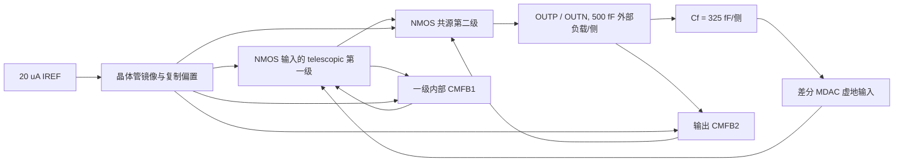

# TSMC28HPC+ 14-bit Pipeline ADC 第一级 MDAC OTA

本文给出 100 MS/s、14-bit pipeline ADC 第一级 4-bit 子 ADC / 增益 8 MDAC
所用全差分 OTA 的指标推导、晶体管级实现和 ngspice 验证方法。许可模型只从本机
`TSMC28_MODEL_DIR` / `TSMC28_PDK_ROOT` / `PDK_ROOT` 解析，不进入仓库；所有可提交
网表都只引用 `tsmc28hpcp.nmos` / `tsmc28hpcp.pmos` 逻辑模型名。

## 1. ADC 到 OTA 的指标推导

### 1.1 噪声和 CDAC

差分满量程正弦为 0.9 Vpp，因此

\[
V_{sig,rms}=\frac{0.9}{2\sqrt 2}=318.2\ \mathrm{mV},\qquad
V_{n,total}=\frac{V_{sig,rms}}{10^{72/20}}=79.9\ \mathrm{\mu V_{rms}}.
\]

级间放大器承担一半噪声功率，分配到 OTA 的 ADC 输入等效预算为
\(79.9/\sqrt 2=56.5\ \mathrm{\mu V_{rms}}\)。把另一半分配给差分采样
\(2kT/C\)，300 K 下每侧最小电容为

\[
C_s\ge\frac{2kT}{(56.5\ \mathrm{\mu V})^2}=2.595\ \mathrm{pF}.
\]

设计取 **每侧 `Cs = Cin = 2.6 pF`**。4-bit CDAC 用 8:4:2:1 加一个 dummy
单位电容，单位电容为 162.5 fF，每侧总和仍为 2.6 pF。

### 1.2 residue 范围和反馈电容

4-bit 子 ADC 后接增益 8，带 1 bit 级间冗余时，标称 residue 为
\(\pm FS/32=\pm28.125\ \mathrm{mV}\)，最大合法 residue 为
\(\pm FS/16=\pm56.25\ \mathrm{mV}\)。闭环差分输出最大为
\(8\times56.25=450\ \mathrm{mV}\)，即每个输出相对共模摆动 ±225 mV。

电荷转移结构的信号增益为 \(C_s/C_f\)，故每侧取

\[
C_f=C_s/8=325\ \mathrm{fF}.
\]

### 1.3 增益、带宽和建立

噪声增益约为 \(1+C_s/C_f=9\)，反馈因子 \(\beta\simeq1/9\)。只考虑有限
开环增益时，要使闭环静态误差小于 0.1%，需

\[
\beta A_0>1000\Rightarrow A_0>9000=79.1\ \mathrm{dB}.
\]

因此规定全 PVT 开环增益通常大于 80 dB。单极点下 5 ns 内进入 0.1% 误差带要求
\(\tau<5\ \mathrm{ns}/\ln(1000)=0.724\ \mathrm{ns}\)，即闭环环路交越至少
220 MHz。设计目标取 300--450 MHz，并用差分 Middlebrook 环路结果而不是开环
传递函数的相位作为稳定性签核值。最大单端 225 mV 摆幅若在 1 ns 内完成主要转换，
按约 1.3 pF 有效输出电容估算，每侧至少需要约 0.29 mA slew 电流。

## 2. OTA 架构



- 主差模通道：NMOS 输入 telescopic cascode 第一级加 NMOS 共源第二级。
- CMFB1：电阻平均 `O1/O2`，晶体管差分对与内部复制参考 `VREF1` 比较，控制
  一级 PMOS 负载 `M7/M8`。
- CMFB2：电阻平均 `OUTP/OUTN`，带 100 Ω 源退化的晶体管差分对与内部 `VCM`
  比较，控制 PMOS 输出负载 `M11/M12`。
- 测试台只提供一个 20 µA 理想 `Iref`。输入共模、级联偏置、两级电流和 CMFB
  参考均由 DUT 内部晶体管复制/镜像网络产生。DUT 中无理想受控源和其他理想偏置。
- 差模、CMFB1、CMFB2 是三个需要签核的实际反馈环路。环路测试台中的注入源属于
  测量探针，不属于 DUT。

## 3. 器件尺寸

下表的几何格式为 **总 W / L / NF**，单位为 µm；对称器件使用相同尺寸。

| 器件 | 作用 | W / L / NF |
|---|---|---:|
| MBN | Iref 二极管 NMOS | 6 / 0.20 / 6 |
| MPRN | NMOS 到 PMOS 参考转换 | 6 / 0.20 / 6 |
| MPR | PMOS 参考二极管 | 1.5 / 0.20 / 2 |
| MPC | NMOS cascode 偏置上拉 | 1.5 / 0.20 / 2 |
| MCND | NMOS cascode 复制管 | 3.15 / 0.30 / 3 |
| MCPD | PMOS cascode 复制管 | 4.35 / 0.30 / 4 |
| MNC | PMOS cascode 偏置下拉 | 6 / 0.20 / 6 |
| MREPP / MREP | CMFB1 参考复制 | 6 / 0.20 / 6；9.6 / 0.30 / 10 |
| MCMP / MCMD | 输入共模复制 | 3 / 0.20 / 3；5 / 0.20 / 5 |
| M0 | 输入级尾电流源，`m=3` 并联倍乘 | 300 / 0.20 / 200 ×3 |
| M1 / M2 | NMOS 差分输入对 | 315 / 0.35 / 200 |
| M3 / M4 | NMOS telescopic cascode | 290 / 0.40 / 200 |
| M5 / M6 | PMOS telescopic cascode | 300 / 0.30 / 200 |
| M7 / M8 | CMFB1 PMOS 负载 | 225 / 0.30 / 200 |
| M9；M10 | 第二级 NMOS 共源管，`m=2` 倍乘 | 300 / 0.40 / 200 ×2；每侧总 W 600 |
| M11；M12 | CMFB2 PMOS 输出负载，`m=3` 倍乘 | 371.43 / 0.40 / 200 ×3；每侧总 W 1114.29 |
| MS1 / MS2 | CMFB1 差分对 | 10 / 0.20 / 10 |
| MT1 | CMFB1 尾电流源 | 9.3 / 0.20 / 9 |
| MDL1 / MDS1 | CMFB1 二极管负载 | 2.25 / 0.30 / 2 |
| MRA / MRB | CMFB2 感测差分对 | 40 / 0.20 / 40 |
| MTB | CMFB2 尾电流源 | 2.325 / 0.20 / 2 |
| MDL2 / MDS2 | CMFB2 二极管负载 | 0.4875 / 0.30 / 1 |

## 4. 偏置、负载和补偿

| 参数 | 数值 | 说明 |
|---|---:|---|
| Iref | 20 µA | 测试台提供的唯一理想参考 |
| VDD | 0.90 V nominal | PVT 为 0.85 / 0.90 / 0.95 V |
| VCM 分压 | 67.2 kΩ / 60 kΩ | 上拉/下拉比例修调用于抵消 CMFB2 系统偏差 |
| Cs / Cf | 2.6 pF / 325 fF 每侧 | CDAC 与增益 8 反馈 |
| CL | 500 fF 每侧 | 规格要求的外部负载 |
| Cc | 400 fF 每侧 | 差模 Miller 补偿；没有额外理想 `COUT` |
| Rz | 100 Ω 每侧 | 对称 poly nulling 电阻，消除 RHP 零点并避免三极区 MOS 的寄生/角落漂移 |
| CMFB1 感测 | 2 × 100 kΩ，2 × 50 fF | 一级共模平均与前馈 |
| CMFB2 感测 | 2 × 100 kΩ，2 × 100 fF | 输出共模平均与前馈 |
| CMFB1 补偿 | 40 pF 串 5 kΩ；1.1 pF Miller | `CTRL1-CMPC1-VDD` 与 `CTRL1-CMS1` |
| CMFB2 补偿 | 40 pF 串 200 Ω | `CTRL2-CMPC2-VDD` lead/nulling 网络 |
| CMFB2 源退化 | 100 Ω 每支 | 降低感测跨导并提高相位裕度 |

`RDC1/RDC2 = 2 MΩ` 只用于建立初始 DC 工作点；每只电阻远端串联一组
0.1/0.2 µm CMOS transmission gate，保持相开始时断开。远端另以 1 TΩ 提供数值
参考，因此 5 ns 电荷转移期间不存在 2 MΩ 泄漏。Cadence 中应替换成实际采样相开关。

## 5. 测试台与判据

| 文件 | 测试内容 |
|---|---|
| `tsmc28hpcp_mdac_ota_ac.json` | 10 kHz 起的开环差分 AC、增益和 UGBW |
| `tsmc28hpcp_mdac_ota_dmloop.json` | 纯差分 Middlebrook 环路，PM > 60° |
| `tsmc28hpcp_mdac_ota_cmfb1.json` | 在高阻感测栅断开的 CMFB1 环路，PM > 60° |
| `tsmc28hpcp_mdac_ota_cmfb2.json` | 在高阻输出共模感测栅断开的 CMFB2 环路，PM > 60° |
| `tsmc28hpcp_mdac_ota_noise.json` | 闭环差分输出噪声；10--50 MHz 为 Nyquist 带内签核，另报 10 MHz--20 GHz wideband stress |
| `tsmc28hpcp_mdac_ota.json` | \(-FS/16,-FS/32,0,+FS/32,+FS/16\) 五档 residue 的 5 ns 建立 |
| `tsmc28hpcp_mdac_ota_code_transition.json` | 8:4:2:1+dummy 分裂 CDAC 的同步互补 0111→1000 major-carry |

建立误差按 \(|V_{OD}(5\,ns)-V_{ideal}|/0.45\) 归一化，必须小于 0.1%。
输出共模在静态、全部五档 residue 建立后和最差码型转换后均须距 `VDD/2` 小于
20 mV。饱和区检查
直接保存 transient 最后一点的 foundry `vds`/`vdsat`，要求 M0/M0B/M0C、M1--M12
及 M9B/M10B、M11B/M11C、M12B/M12C 在静态、最大
正负 residue 和最差码型转换后满足 \(|V_{DS}|\ge|V_{DSAT}|\)。

PVT 网格为 `tt/ss/ff/sf/fs × -40/27/125 °C × 0.85/0.90/0.95 V`，共 45 点。
运行命令：

```bash
.venv/bin/python experiments/tsmc28_mdac_pvt_campaign.py --workers 4
```

CSV 会逐点落盘到 `results/tsmc28_mdac_ota_pvt45.csv`，中断后可续跑；`--force`
用于清空并重跑。

## 6. 标称结果

本节的最终数值由 `results/tsmc28_mdac_ota_pvt45.csv` 中 TT / 27 °C / 0.90 V
一行自动核对后填写，避免保留调优中间版本的数据。

噪声签核积分带宽为 ADC Nyquist 带内 10--50 MHz，输出差分积分噪声除以闭环增益 8
得到 ADC 输入等效噪声；同一条 PSD 另积分 10 MHz--20 GHz 并作为 wideband stress
报告。下限选在测试台 DC 辅助通路拐点以上；该通路只用于给
浮置虚地求 DC 解，电容反馈在更低频开路，所以把保持相 LTI `.noise` 外推到 1 Hz
会测到并不存在于 5 ns 保持窗口内的开环噪声。实测 1 Hz--20 GHz 的 69.8 mV
正是这个测试台伪影，不能用于 ADC SNR。完整两相开关的低频、采样与折叠噪声仍需
Cadence PSS/PNoise；本文的数值是明确带宽下的 OTA 保持相闭环噪声。功耗 FOM
采用 `P/fs`，Schreier 参考值采用 `72 + 10log10(fs/P)`；后者不是整机 ADC
实测 FOM。

## 7. PVT 汇总与最差角

本节由完整 45 点 CSV 签核后更新。CSV 是数值单一事实来源，文档只保留通过范围、
最差角及根因，不复制 45 行原始数据。
