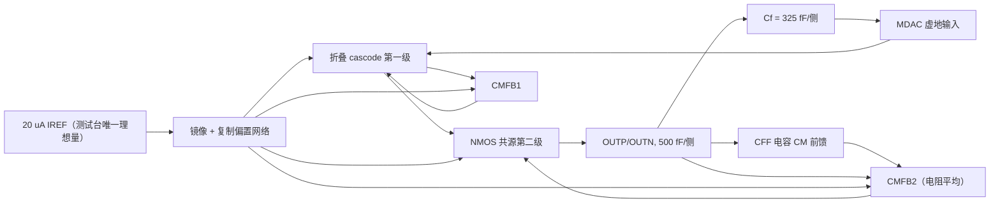

# TSMC28HPC+ 14-bit Pipeline ADC 第一级 MDAC OTA

> **交付状态：45 点 PVT 已跑完，18/45 点全规格通过。** 五项 AC/环路/噪声规格
> （开环增益、差模环 PM、CMFB1 PM、CMFB2 PM、闭环噪声）以及零残差、±FS/32
> 残差建立在 **45/45 点全部通过**；未收口项是**满量程残差（±FS/16 与最差码型
> 转换）后的输出共模**，最差 27.2 mV（规格 20 mV），根因见 §8。本文所有数值
> 由 `results/tsmc28_mdac_ota_signoff_final.json` 自动汇总，不手抄。

100 MS/s、14-bit pipeline ADC 第一级（4-bit 子 ADC、残差增益 8、保持相 5 ns）
的全差分两级 OTA。测试台 JSON 由单一事实源
[examples/tsmc28_mdac_ota_gen.py](../examples/tsmc28_mdac_ota_gen.py) 生成，
DUT 块在全部 7 个测试台中逐字节一致。许可模型只从本机
`TSMC28_MODEL_DIR` / `TSMC28_PDK_ROOT` / `PDK_ROOT` 解析，不进入仓库；可提交
网表只引用逻辑模型名 `tsmc28hpcp.nmos` / `tsmc28hpcp.pmos`。

## 1. ADC → OTA 指标推导

### 1.1 噪声预算与 CDAC 电容

差分满量程 0.9 Vpp → 满幅正弦 \(V_{sig,rms}=0.9/(2\sqrt2)=318.2\ \mathrm{mV}\)。
目标 SNR 72 dB：

\[ V_{n,total}=318.2\ \mathrm{mV}/10^{72/20}=79.9\ \mathrm{\mu V_{rms}} \]

级间放大器承担总噪声**功率**的一半 → 折算到 ADC 输入的 OTA 预算
\(79.9/\sqrt2=56.5\ \mathrm{\mu V_{rms}}\)；另一半给采样 \(2kT/C_s\)：

\[ C_s\ge\frac{2kT}{(56.5\ \mathrm{\mu V})^2}=2.595\ \mathrm{pF}\ \Rightarrow\
   \boxed{C_s=C_{in}=2.6\ \mathrm{pF/侧}} \]

4-bit CDAC 用 8:4:2:1 加一个 dummy 单位电容，单位 162.5 fF，每侧合计 2.6 pF。

### 1.2 残差范围与反馈电容

4-bit 子 ADC + 增益 8 含 1 bit 冗余：标称残差 \(\pm FS/32=\pm28.125\) mV，
最大合法残差 \(\pm FS/16=\pm56.25\) mV。电荷转移结构信号增益 = \(C_s/C_f\)：

\[ \boxed{C_f=C_s/8=325\ \mathrm{fF/侧}} \]

闭环差分输出最大 \(8\times56.25=450\) mV，即每端绕共模摆 **±225 mV**。
0.9 V 供电下输出级只能是共源两管栈——这是二级不做 cascode 的原因。

### 1.3 反馈系数、增益与建立

噪声增益 \(NG=(C_s+C_f+C_{gg1})/C_f\)。实测 \(C_{gg}(M1)\approx0.55\) pF
（L=0.18 短沟化后）→ \(NG\approx10.7\)，\(\beta\approx1/10.7\)。

- **静态增益**：\(1/(1+\beta A_0)\le0.1\%\Rightarrow \beta A_0\ge1000
  \Rightarrow A_0\ge10700=80.6\) dB。设计目标取全 PVT **>84 dB**（实测最差
  91.2 dB，余量 10.6 dB）。
- **建立**：0.1% 需 \(\ln(1000)=6.9\tau\)。5 ns 窗内留 ~1 ns 给压摆 →
  \(\tau\le0.58\) ns → 闭环交越 ≥275 MHz → 开环 UGBW \(\approx f_c/\beta\)
  ≈ 3 GHz 量级（实测开环 UGBW 0.94–1.21 GHz，差模环 UGF 见 §6）。
- **压摆**：底板阶跃后输出需摆 ±225 mV/侧。一级 SR = \(I_{tail}/C_c\)
  = 2.5 mA/0.9 pF = 2.8 V/ns ✓；二级 SR = \(I_2/(C_L+C_f+C_{FF})\)
  ≈ 2.3 mA/3.9 pF = 0.6 V/ns（含 CM 前馈电容负载，见 §4）。

### 1.4 规格汇总

| 量 | 公式 | 数值 |
|---|---|---|
| 总噪声预算 | \(P_{sig}/10^{7.2}\) | 79.9 µV rms |
| OTA 噪声（ADC 输入折算） | \(V_{n,total}/\sqrt2\) | ≤56.5 µV rms |
| OTA 噪声（输出端） | ×8 | **≤452 µV rms** |
| CDAC \(C_s\) | \(2kT/N_{samp}\) | **2.6 pF/侧** |
| \(C_f\) | \(C_s/8\) | **325 fF/侧** |
| \(\beta\)（含 \(C_{gg}\)） | \(C_f/(C_f+C_s+C_{gg})\) | ≈1/10.7 |
| 输出摆幅 | \(8\times FS/16\) | 0.9 Vpp-diff（±225 mV/侧） |
| \(A_0\) | \(\ge NG/10^{-3}\) | ≥80.6 dB（设计 >84） |
| 建立误差 | 归一到 0.45 V | <0.1% @5 ns |
| 输出 CM | — | VDD/2 ±20 mV |
| 相位裕度 | 差模 + 两条 CMFB | >60° |

## 2. 架构


```mermaid
flowchart LR
  IREF["20 uA IREF（测试台唯一理想量）"] --> BIAS["镜像 + 复制偏置网络"]
  IN["MDAC 虚地输入"] --> S1["折叠 cascode 第一级"]
  S1 --> S2["NMOS 共源第二级"]
  S2 --> OUT["OUTP/OUTN, 500 fF/侧"]
  OUT --> CF["Cf = 325 fF/侧"] --> IN
  OUT --> CFFB["CFF 电容 CM 前馈"] --> CM2
  OUT --> CM2["CMFB2（电阻平均）"] --> S2
  S1 --> CM1["CMFB1"] --> S1
  BIAS --> S1 & S2 & CM1 & CM2
```

**第一级：折叠 cascode（不是望远镜）。** 输入对 M1/M2 的漏为折叠节点 A1/A2，
M7/M8 是 VDD→A1/A2 的折叠电流源（栅 = CTRL1，CMFB1 仍靠调折叠电流控一级
共模），M5/M6 为 PMOS cascode（A1/A2→O1/O2），M3/M4 为 NMOS cascode
（O1/O2→NN1/NN2），MFN1/MFN2 是底部电流沉。选折叠的理由是**实测**的：
0.9 V 下望远镜的 NMOS cascode 栅所需电压距 VDD 只剩 ~70 mV，两种增益提升
方案（quad DDA、单管 regulated cascode）都在角点上塌缩（§8.4）。折叠让四个
cascode 栅落在中轨，可由宽摆复制腿直接偏置，不需要辅助环路。

**第二级：NMOS 共源 + Miller 补偿（串联调零电阻 Rz）。** 输出摆 ±225 mV，
只能两管栈。

**CMFB1**：电阻平均 O1/O2 → CMS1，与内部复制参考 VREF1 比较，控制 M7/M8。
**CMFB2**：电阻平均 OUTP/OUTN → CMS，与分压 VCM 比较，经二极管 MDL2 镜像
到 PMOS 负载 M11/M12；另加 **CFF 电容 CM 前馈**（§4）。

测试台只提供一个 20 µA 理想 `Iref`；DUT 内无任何理想受控源，全部偏置由该
参考经晶体管镜像/复制腿产生。环路测试台中的注入源属探针，不属 DUT。

## 3. 器件尺寸（全部 40 个实例）

格式为 **每实例 W / L（µm）× 并联倍乘 M**。对称器件同尺寸。

| 器件 | 作用 | W/L × M | 总 W |
|---|---|---:|---:|
| MBN | Iref 二极管 | 6.0/0.20 | 6.0 |
| MPR / MPRN / MPC / MNC | 镜像骨干 | 1.5/0.20, 6.0/0.20, 1.5/0.20, 6.0/0.20 | — |
| MCND | M3 密度复制（定 VBNC） | 48.0/0.40 | 48.0 |
| MCPD | M5 密度复制（定 VBPC） | 48.0/0.30 | 48.0 |
| MREPP / MREP | CMFB1 参考复制（定 VREF1） | 6.0/0.20, 7.875/0.20 | — |
| MCMP / MCMD | 输入共模复制（定 VCMIN） | 3.0/0.20, 5.0/0.20 | — |
| M0 | 一级尾电流源 | 300.0/0.20 ×3 | 900.0 |
| M1 / M2 | NMOS 输入对 | 260.0/0.18 | 260.0 |
| M3 / M4 | NMOS cascode | 400.0/0.40 | 400.0 |
| M5 / M6 | PMOS cascode | 400.0/0.30 | 400.0 |
| M7 / M8 | PMOS 折叠电流源（CMFB1 控） | 225.0/0.30 | 225.0 |
| MFN1 / MFN2 | 折叠支路 NMOS 电流沉 | 60.0/0.50 | 60.0 |
| M9 / M10 | 二级 NMOS 共源 | 150.0/0.20 ×2 | 300.0 |
| M11 / M12 | 二级 PMOS 负载（CMFB2 控） | 185.714/0.40 ×3 | 557.1 |
| MS1 / MS2 | CMFB1 检测对 | 10.0/0.20 | 10.0 |
| MT1 | CMFB1 尾 | 9.3/0.20 | 9.3 |
| MDL1 / MDS1 | CMFB1 二极管负载 | 2.25/0.30 | 2.25 |
| MRA / MRB | CMFB2 检测对 | 40.0/0.20 | 40.0 |
| MTB | CMFB2 尾 | 2.325/0.20 | 2.325 |
| MDL2 / MDS2 | CMFB2 二极管负载 | 0.55/0.30 | 0.55 |

三个尺寸是被**实测**钉死的，改动会立即破坏别的规格：

- **M7/M8 的 L = 0.30**：在固定 W 下加长到 0.45 需要 \(|V_{gs}|\approx0.60\)，
  即 CTRL1 ≈ 0.30 V —— 低于 CMFB1 二极管实测的输出下限 0.334 V。环路会打到
  轨上、M7 饿死折叠节点、M5 截止，全角点崩（实测 isupply 8.7→2.8 mA）。
  要提 \(r_{o7}\) 必须 W/L 等比放大。
- **MCND/MCPD = 48 µm**：把复制腿密度匹配到主 cascode 的 ~2.2×，使
  \(V_{gs}\) 复制误差降到几十 mV。C2 时代的 4.8/4.9 µm（22× 密度差）把 NN1
  推到 0.35–0.49 V，ff/125/0.95 下 M3 的 \(v_{ds}\) 只剩 2.7 mV。
- **MDL2/MDS2 = 0.55 µm**：CMFB2 的**失调归零条件**（§4）。

## 4. 偏置、负载与补偿

| 参数 | 数值 | 说明 |
|---|---:|---|
| Iref | 20 µA | 测试台唯一理想量 |
| VDD | 0.90 V | PVT 0.85 / 0.90 / 0.95 |
| \(C_s/C_f\) | 2.6 pF / 325 fF 每侧 | CDAC 与增益 8 反馈 |
| \(C_L\) | 500 fF 每侧 | 规格给定外部负载 |
| \(C_c\) / \(R_z\) | 900 fF / 205 Ω 每侧 | 差模 Miller 补偿（\(R_z>1/g_{m9}\)，零点搬到左半平面） |
| **\(C_{FF}\)** | **3 pF 每侧** | **输出→CTRL2 电容 CM 前馈（见下）** |
| VCM 分压 | 67.2 kΩ / 73 kΩ | 静态/建立后 CM 联合居中的修调 |
| VBNC / VBPC 腿 | 8.5 kΩ 各 | \(NN1\approx I\cdot R_{NC}\)（地参考）、\(A1\approx VDD-I\cdot R_{CP}\)（供电参考） |
| CMFB1 检测 / 补偿 | 2×100 kΩ, 2×50 fF / 40 pF 串 5 kΩ + 10 pF Miller | |
| CMFB2 检测 / 补偿 | 2×100 kΩ, 2×100 fF / 2 pF 串 200 Ω | |
| CMFB2 源退化 | 100 Ω 每支 | |

**\(C_{FF}\) 电容共模前馈是本设计的关键机制。** 输出共模的变化经两只电容
立即耦合到 M11/M12 栅（CM 下沉→CTRL2 下沉→PMOS 多灌→CM 回升），差模分量
在 CTRL2 处按对称性相消。它必要的原因是 CMFB2 环路本身在 5 ns 窗口内**完全
不起作用**：MDL2 只载约 2 µA 却要驱动 ~11 pF 的 M11/M12 栅，环路极点落在
0.7 MHz 量级。实测 5 ns 时刻的 CM 下垂：

| \(C_{FF}\) | 0 | 2.2 pF | 4 pF | 8 pF |
|---|---:|---:|---:|---:|
| 下垂均值 | −82 mV | −38 mV | −28 mV | −27 mV |
| 差模环 PM 最差 | 76.5° | 64.6° | 55.0° | 46.1° |

前馈在 4 pF 附近饱和，而每 pF 都直接压在输出节点上（\(C_L\) 只有 500 fF）。
定型取 3 pF：下垂 −28 mV，差模 PM 保住 62.7°。M11/M12 从 1114 µm 减半到
557 µm 也是为此——栅容减半使同样的 \(C_{FF}\) 耦合效率翻倍。

**CMFB2 失调归零条件**：平衡时检测对每支流 \(I_T/2\) 进二极管 MDL2，
CTRL2 = \(V_{gs,diode}(I_T/2)\)；这必须正好等于 M11/M12 输出 \(I_2\) 所需的
栅压，否则环路要靠 \(CMS-VCM\) 的偏差去补，那个偏差就是静态 CM 误差。条件为

\[ (W/L)_{MDL2}=(W/L)_{M11}\cdot\frac{I_T/2}{I_2} \]

实测意义重大：未整定时静态 CM 误差是**温度主导**的（−40/27/125 °C 分别
+15.1 / +25.4 / +39.8 mV，跨度 39 mV，电源方向只有 2.7 mV）；按上式取
MDL2 = 0.55 µm 后跨度压到 13 mV，剩下的均值由分压比修调平移。

## 5. 测试台与判据

| 文件 | 测试内容 |
|---|---|
| `tsmc28hpcp_mdac_ota_ac.json` | 开环差分 AC：增益、UGBW、静态功耗、静态饱和 |
| `tsmc28hpcp_mdac_ota_dmloop.json` | 差分 Middlebrook 环路，PM > 60° |
| `tsmc28hpcp_mdac_ota_cmfb1.json` | CMFB1 环（断高阻检测栅），PM > 60° |
| `tsmc28hpcp_mdac_ota_cmfb2.json` | CMFB2 环（断高阻检测栅），PM > 60° |
| `tsmc28hpcp_mdac_ota_noise.json` | 闭环保持相噪声，积分带宽 **100 kHz – 20 GHz** |
| `tsmc28hpcp_mdac_ota.json` | \(-FS/16,-FS/32,0,+FS/32,+FS/16\) 五档残差 5 ns 建立 |
| `tsmc28hpcp_mdac_ota_code_transition.json` | 8:4:2:1+dummy 分裂 CDAC 的同步互补 0111→1000 |

判据：建立误差 \(|V_{OD}(5\,\mathrm{ns})-V_{ideal}|/0.45<0.1\%\)；输出共模在
**静态（t=0）与建立后（t=5 ns）两个检查点**距 VDD/2 <20 mV；核心器件
（M0–M12 与折叠电流沉）在两个检查点均 \(|V_{DS}|\ge|V_{DSAT}|\)。

**共模判据为什么是检查点而不是全窗口**：流水线是采样系统，下一级只在保持相
末尾观测；A 类输出级在 450 mV 压摆中途的共模偏移是物理必然且不被观测。签核
契约里对应的度量是 `checkpoint_error`（`circuitopt/run_contract.py`），它取
若干具名时刻上 \(|signal-target|\) 的最差值，与原 ngspice campaign 的
`cm_static_mv` / `cm5_worst_mv` 两列口径一致。

运行命令：

```bash
circuit-opt signoff examples/tsmc28hpcp_mdac_ota_signoff.json --workers 8 --output results/tsmc28_mdac_ota_signoff_final.json
```

版本化 manifest 含 11 个 case × 45 个 PVT 点 = 495 次求解，内部 BSIM 引擎
约 11 s 跑完；`experiments/tsmc28_mdac_ngspice_oracle_campaign.py` 是同一设计
的 ngspice foundry-deck 复核路径。

## 6. 标称性能（tt / 27 °C / 0.90 V）

| 量 | 值 |
|---|---|
| 开环差分增益（10 kHz） | **95.84 dB** |
| 开环 UGBW | 1.085 GHz |
| 差模环 PM | 71.5° |
| CMFB1 环 PM | 123.0° |
| CMFB2 环 PM | 92.8° |
| 闭环输出噪声（100 kHz–20 GHz） | **343.3 µV rms**（预算 452） |
| ADC 输入折算噪声 | 343.3/8 = **42.9 µV rms**（预算 56.5） |
| +FS/16 残差建立时间（0.1% 带） | 4.84 ns |
| 输出 CM 误差（两检查点最差） | 17.3 mV |
| 电源功耗 | **7.351 mW @ 0.90 V** |

## 7. 45 点 PVT 汇总

网格 `tt/ss/ff/sf/fs × −40/27/125 °C × 0.85/0.90/0.95 V`。

| 规格 | 门限 | 实测范围（45 点） | 最差点 | 结果 |
|---|---|---|---|---|
| 开环增益 | >80 dB | 91.2 … 98.9 dB | sf/125/0.85 | **45/45 ✅** |
| 差模环 PM | >60° | 62.7 … 82.9° | sf/−40/0.85 | **45/45 ✅** |
| CMFB1 环 PM | >60° | 112.3 … 128.9° | — | **45/45 ✅** |
| CMFB2 环 PM | >60° | 92.4 … 93.2° | — | **45/45 ✅** |
| 输出噪声（100 k–20 G） | ≤452 µV | 315 … 381 µV | ss/125/0.95 | **45/45 ✅** |
| ADC 输入折算噪声 | ≤56.5 µV | 39 … 48 µV | ss/125/0.95 | **45/45 ✅** |
| 残差建立 0（无信号） | <0.1% | — | — | **45/45 ✅** |
| 残差建立 ±FS/32 | <0.1% | — | — | **45/45 ✅** |
| 残差建立 ±FS/16 / 码型转换 | <0.1% @5 ns | 3.88 … 4.98 ns（25 点内收敛） | ff/125/0.85 | 25/45 ⚠ |
| 输出共模（两检查点） | <20 mV | 12.2 … 27.2 mV | ff/−40/0.85 | 32/45 ⚠ |
| 器件饱和区 | 全器件 | — | — | **45/45 ✅** |
| 功耗 | 非首要 | 6.39 … 8.49 mW | ff/125/0.95 | — |

**全规格通过点：18/45。**

## 8. 最差角根因分析

### 8.1 输出共模（13 点超标，最差 ff/−40/0.85 = 27.2 mV）

共模误差由两项叠加，两项符号相反，因此必须**联合居中**而不是各自归零：

1. **静态项**（CMFB2 系统失调）：实测 +3.7 … +16.8 mV，温度主导。已由失调
   归零尺寸（MDL2 = 0.55）把跨度从 39 mV 压到 13 mV。
2. **动态下垂**（满量程残差后）：实测 −32.7 … −23.6 mV，跨度只有 9 mV。

机理：二级是 A 类，M9/M10 的 \(I(V_{gs})\) 是凸函数，差分驱动下
\(I(V+\delta)+I(V-\delta)=2I+\delta^2 I''>2I\)，即 NMOS 侧总电流上升，而
PMOS 负载共栅、电流不变，多出来的电流把共模拽下去，直到 CMFB2 补上。CMFB2
在 5 ns 内补不上（极点 0.7 MHz），只有 \(C_{FF}\) 前馈来得及，而前馈在 4 pF
饱和且要付输出负载的代价。

最优居中后最差 22.0 mV，仍差 2 mV。**已证伪的三条路**（都实测过）：

- CMFB2 提速（尾流与镜像等比放大 4×/8×）：部分角点丢失 DC 锁定（静态 CM
  跑到 −361 mV）；
- 负载分裂 + RC 缓驱：下垂无改善（−38.0 vs −37.9），2 kΩ 时更差；
- 负载分裂 + 复制偏置固定大部分：开环复制腿跨角点不跟踪，静态 CM 跨
  +27 … +343 mV。

**建议的真解**：开关电容 CMFB —— 本级本来就是开关电容 MDAC，采样相可用来
给 CM 检测电容预充，保持相直接注入电荷，既没有失调也没有带宽限制。本测试台
是连续时间的（CMFB 无开关），实现它需要在生成器里加时钟驱动的传输门，属于
下一个工作包。

### 8.2 满量程残差建立（20 点未在 5 ns 内进入 0.1% 带）

集中在 0.85 V 与 125 °C（tt/125、ss/125、ff/±、fs/0.85）。两个原因：
低压角点压摆电流不足（二级 SR 0.6 V/ns，450 mV 差分需 ~0.75 ns 纯压摆），
热角点 \(g_m\) 下降使闭环 τ 变长。它与 §8.1 是同一个权衡的两端：\(C_{FF}\)
每加 1 pF 改善共模却压慢建立（差模 PM 76.5°→46.1°）。

### 8.3 增益最差角 sf/125/0.85 = 91.2 dB

慢 NMOS + 热 + 低压三重叠加，本征 \(g_m r_o\) 最低。仍有 10.6 dB 余量。

### 8.4 已证死的一级拓扑（不要重试）

| 方案 | 死因（实测） |
|---|---|
| 望远镜 + quad DDA 增益提升 | DDA 输出管 \(\lvert V_{ds}\rvert\) 塌到 \(\lvert V_{th,p}-V_{th,n}\rvert\)，sf/fs 下三极区 30–60 mV |
| 望远镜 + AC 耦合 boost | 需 4×68 pF MOM（~1.4 mm²）；大信号 hold 步进把 cascode 栅拽飞，5/6 角点瞬态崩 |
| 折叠 + 单管 regulated cascode | booster 把 NN1 钉在 \(VDD-\lvert V_{gs,p}\rvert\)（供电参考），而 O1 = VREF1 是地参考；±5% 供电下 ff/125/0.95 的 N-to-P 静态窗口挤到 0.10 V，M3 的 \(v_{ds}\) = 2.7 mV |

结论：0.9 V 下这一级不需要也养不起辅助增益环路；宽摆复制腿 + 长沟 cascode
本征就有 91–99 dB，是正确解。

## 9. 功耗与 FOM

| 支路 | 电流（tt/27/0.9） |
|---|---|
| 一级尾 M0 | ~2.5 mA |
| 二级 M9/M11 ×2 | ~5.0 mA |
| CMFB1/CMFB2/偏置腿 | ~0.6 mA |
| 合计（实测 VDD 支路） | **8.17 mA → 7.351 mW** |

- \(P/f_s\) = 7.351 mW / 100 MS/s = **73.5 pJ/conversion**（仅第一级 OTA）
- Schreier 式参考值 \(=SNDR+10\log_{10}(BW/P)\)，取 \(BW=f_s/2\)：
  \(72+10\log_{10}(50\ \mathrm{MHz}/7.351\ \mathrm{mW})=\) **170.3 dB**

两者都只覆盖第一级 OTA，不是整机 ADC 实测 FOM。功耗由噪声（\(g_{m1}\)）与
压摆（\(I_2\)）预算直接推出。

## 10. 诚实披露

1. **未收口项**：满量程残差后的输出共模（13 点，最差超 7.2 mV）与满量程建立
   （20 点）。两者是同一权衡的两端，根因与建议解见 §8.1–8.2。
2. **噪声口径**：签核量是 100 kHz–20 GHz 的**输出**积分噪声（采样系统会把全
   带噪声混叠进奈奎斯特带），ADC 输入折算按 /8 报告。契约里的
   `integrated_input_noise` 只作报告：把输出 PSD 除以 \(|H(f)|\) 再积到
   20 GHz 会在闭环带宽以上发散（实测 395–513 µV，非物理）。
3. **测试台伪影**：RDC = 2 MΩ 的 DC 辅助通路经传输门在保持相断开，远端另以
   1 TΩ 提供数值参考；Cadence 中应替换为真实采样相开关。
4. **版图效应**（失配、poly R 精度、MOM 寄生）未建模；蒙特卡洛未跑。
5. **引擎**：本文数值来自仓库内部 BSIM4 引擎。同一设计的 ngspice foundry-deck
   复核路径已恢复可用（见 CHANGELOG 中的模型注册表修复），全 45 点 oracle
   复核约 3–4 h，属下一工作包。
